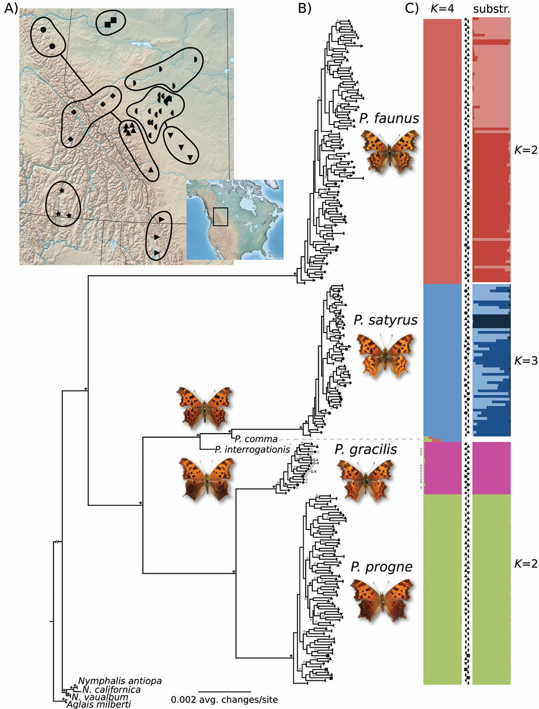

# Fully integrative species delimitation with *delimSOM* 2.0

*delimSOM* 2.0 is an *R* package for fully integrative species delimitation using single- and multilayer self-organizing maps (SOMs). 

SOMs are unsupervised machine-learning models that organize high-dimensional data on a two-dimensional grid map so individuals with similar overall patterns are represented near one another (Kohonen 1998, 2014).
Different sources of information, such as genomic, morphological, environmental, or spatial data, are retained as separate layers while jointly contributing to the same map.
Any data that can be represented quantitatively for a common set of individuals can be incorporated, including continuous, binary, categorical, and count data.

Each cell in the grid is represented by a codebook vector that summarizes the local multivariate "average" of the individuals mapped to it.
During training, individuals are repeatedly matched to the most similar cell, and that cell and its neighbors are updated toward their measurements.
Over many training steps, this produces an organized map where similar individuals become represented in nearby regions and dissimilar individuals farther apart.
Because the observations are summarized by few codebook vectors, SOMs can reduce sensitivity to  noise and reveal broader structure in complex datasets.
After SOM training, the codebook vectors are clustered into groups that are interpreted as candidate lineages (Pyron et al. 2023).

The framework does not require predefined species assignments and explicitly permits K = 1, so subdivision is only inferred when supported (Janes et al. 2017; Pyron et al. 2023).
Multiple SOM replicates quantify support for alternative K values and the stability of individual assignments.
Data layers are automatically balanced so that no single layer dominates the analysis.
The method is also robust to missing data, because individual matching and codebook-vector updates use only observed variables, allowing the contribution of incomplete individuals without global imputation (Samad & Harp 1992).
*delimSOM* relies heavily on the *kohonen* *R* package (Wehrens & Buydens 2007; Wehrens & Kruisselbrink 2018).

This allows heterogeneous evidence to be analyzed jointly within a single framework, incorporating multiple dimensions of ecological and evolutionary divergence to delimit candidate lineages.


## Main advantages of the approach

- Supports any input data
- Jointly integrates multiple data types in a single analysis
- Automatically balances contributions among data layers
- Allows K = 1
- Does not require predefined species assignments
- Robust to missing data 
- Quantifies relative support across multiple K values
- Provides STRUCTURE-like plots of replicate-consensus assignments
- Includes six alternative clustering and K-selection approaches
- Includes diagnostics and visualizations


## Update: version 2.0

We have now released version 2.0 of the delim-SOM framework!

The species-delimitation framework was introduced by Pyron et al. (2023) for genetic data and subsequently extended by Pyron (2023) to multilayer SOMs for integrative species delimitation by presenting *delimSOM*.
With *delimSOM* 2.0 (Schönberger et al. 2026), we expand the original framework into a comprehensive *R* package with improved data preprocessing and SOM training, new clustering and K-selection approaches, extensive diagnostics and visualizations, and revised variable- and layer-importance analyses.

Current *R* package version: `2.0.0.9000`

For bug reports, feedback, or questions, please contact Daniel Schönberger: daniel.schoenberger@uky.edu.


# A) Basic tutorial

## 1. Installation

Install and load the *delimSOM* *R* package:

```r
if (!requireNamespace("remotes", quietly = TRUE)) install.packages("remotes")
remotes::install_github("rpyron/delim-SOM", ref = "dev2.0")

library(delimSOM)
packageVersion("delimSOM")
```


## 2. Input data

Input data should be supplied as one or multiple numeric matrices or data frames.
Rows should represent individuals and columns variables.
For multilayer analyses, use individual identifiers as row names in every layer.
Missing values should be represented as `NA`.

Single-layer example input:

| | SNP_1 | SNP_2 | SNP_3 | SNP_4 |
|---|---:|---:|---:|---:|
| Individual_1 | 0 | 1 | 2 | 0 |
| Individual_2 | 1 | 1 | 0 | 2 |
| Individual_3 | 2 | 0 | 1 | 1 |
| Individual_4 | 0 | 2 | NA | 1 |

```r
genomic_matrix <- matrix(c(0, 1, 2, 0,
                           1, 1, 0, 2,
                           2, 0, 1, 1,
                           0, 2, NA, 1),
                         nrow = 4,
                         byrow = TRUE,
                         dimnames = list(c("Individual_1", "Individual_2", "Individual_3", "Individual_4"),
                                         c("SNP_1", "SNP_2", "SNP_3", "SNP_4")))

SOM_data_single <- genomic_matrix
```

Multilayer example input (requires a list):

```r
SOM_data_multi <- list(
  Genomic = genomic_matrix,
  Morphology = morphology_matrix,
  Spatial = spatial_matrix
)
```

## 3. Data processing

We provide several functions to prepare, filter, and process different input data types, making them suitable for subsequent SOM analyses.

### 3.1 Genetic data

`process.SNP.data.SOM()` can be used to process and filter genetic data.
Supported inputs include VCF, `genind`, `genlight`, numeric SNP-dosage matrices, PLINK `.raw`, NEXUS, FASTA, and PHYLIP.
For VCF input, retained biallelic SNPs are converted to numeric 0/1/2 dosage data.
The function returns a numeric matrix with individuals as rows and retained biallelic loci as columns, ready for SOM training. 
For diploid genotype data, loci are encoded as 0/1/2 dosage values.

VCF example using the recommended default filters:
This filtering first removes loci with >70% missing data, then individuals with >50% missing data, followed by a final locus filter of >50% missing data. 
Singleton and invariant loci are also removed by default (but can be retained using `singleton.loci.filter = FALSE` or `invariant.loci.filter = FALSE`).


```r
SNP_data <- process.SNP.data.SOM(vcf.path = "data/data.vcf",
                                 missing.loci.cutoff.lenient = 0.7,
                                 missing.loci.cutoff.final = 0.5,
                                 missing.individuals.cutoff = 0.5)
```

Other supported genetic input formats can be supplied as follows:

```r
# genind object
SNP_data <- process.SNP.data.SOM(genind.input = genind_object)

# genlight object
SNP_data <- process.SNP.data.SOM(genlight.input = genlight_object)

# Numeric diploid SNP dosage matrix or data frame
SNP_data <- process.SNP.data.SOM(snp.matrix.input = SNP_matrix,
                                 snp.matrix.ploidy = 2)
                                 
# Numeric haploid SNP dosage matrix or data frame
SNP_data <- process.SNP.data.SOM(snp.matrix.input = SNP_matrix,
                                 snp.matrix.ploidy = 1)

# PLINK .raw file
SNP_data <- process.SNP.data.SOM(plink.raw.path = "data/data.raw")

# NEXUS alignment
SNP_data <- process.SNP.data.SOM(nexus.path = "data/data.nex")

# FASTA alignment
SNP_data <- process.SNP.data.SOM(fasta.path = "data/data.fasta")

# PHYLIP alignment
SNP_data <- process.SNP.data.SOM(phylip.path = "data/data.phy",
                                 phylip.format = "sequential")
```

### 3.2 Categorical data

Categorical variables can be converted to binary indicator variables (0/1) with `make.cols.binary.SOM()`.
This function converts each observed category into a separate binary column.
For example, a `Habitat` variable with `"forest"` and `"grassland"` will create two columns called `Habitat_forest` and `Habitat_grassland` filled with 0 (absent) or 1 (present).
Missing values remain `NA`.
By default, the function returns only the newly generated binary indicator columns suitable for SOM training.

Example converting two categorical variables called `Host` and `Habitat`:

```r
binary_data <- make.cols.binary.SOM(dataframe = categorical_data,
                                    make.binary.cols = c("Host", "Habitat"))
```

### 3.3 Continuous data

Continuous environmental, morphological, or other numeric data can be filtered with `remove.lowCV.multicollinearity.SOM()`.
This function removes variables with negligible variation or strong correlations.
By default, variables with a coefficient of variation ≤0.05 are removed, followed by iterative removal of variables with pairwise absolute Spearman correlations >0.9.

Example using the recommended default filters:

```r
continuous_data <- remove.lowCV.multicollinearity.SOM(input.dataframe = continuous_data,
                                                      CV.threshold = 0.05,
                                                      cor.threshold = 0.9)
```

Specific columns can be ignored for filtering but retained in the dataset using `exclude.cols`, for example coordinates or identifiers:

```r
continuous_data <- remove.lowCV.multicollinearity.SOM(input.dataframe = continuous_data,
                                                       CV.threshold = 0.05,
                                                       cor.threshold = 0.9,
                                                       exclude.cols = c("Latitude", "Longitude", "ID"))
```


## 4. SOM training and clustering

The core analysis of *delim-SOM* consists of training replicate SOMs and then clustering their codebook vectors to identify candidate lineages.
For multilayer analyses, only individuals shared across all layers are retained.

### 4.1 SOM training

First, we train multiple SOM maps using the recommended defaults. 
`N.steps` controls the number of training iterations for each SOM, while `N.replicates` controls the number of independently trained SOMs.
Replicates are run in parallel by default (recommended for large datasets), with the number of cores specified using `N.cores` (3-4 cores worked well in testing).
Samples and variables containing more than 50% missing data are removed by default using `max.NA.row = 0.5` and `max.NA.col = 0.5`.
Results can be saved during training using `save.SOM.results = TRUE` and `save.SOM.results.name`.

```r
SOM_tr <- train.SOM(input_data = SOM_data,
                    parallel = TRUE,
                    N.cores = 3,
                    N.steps = 100,
                    N.replicates = 110,
                    max.NA.row = 0.5,
                    max.NA.col = 0.5,
                    save.SOM.results = TRUE,
                    save.SOM.results.name = "SOM_tr.Rdata")
```


### 4.2 SOM clustering

After SOM training, the codebook vectors from each replicate are clustered into groups. These are then interpreted as candidate lineages and estimate support for alternative values of K (Pyron et al. 2023).
Although we implement six alternative clustering and K-selection approaches, we recommend using the `"kmeans+BICelbow"` approach:
it first applies k-means clustering to the codebook vectors across alternative K values and then uses a conservative BIC-elbow criterion to select the best-supported K.
This approach performed best in our analyses (Schönberger et al. 2026) and has also been used successfully in previous SOM-based species-delimitation analyses (Pyron et al. 2023; Pyron 2023).
`max.k` specifies the maximum number of candidate clusters evaluated.
Results can be saved during clustering using `save.SOM.results = TRUE` and `save.SOM.results.name`.

```r
SOM_results <- clustering.SOM(SOM.output = SOM_tr,
                              max.k = 10,
                              clustering.method = "kmeans+BICelbow",
                              save.SOM.results = TRUE,
                              save.SOM.results.name = "SOM_results.Rdata")
```


By default, alternative values from K = 1 to `max.k` are evaluated and the optimal K is selected separately for each SOM replicate.
Clustering can also be rerun for a single K value by supplying `set.k`, which bypasses automatic K-selection while retaining the replicate SOM framework.
This is useful when automatic K-selection fails after visual inspection of the BIC curve or when multiple K values receive substantial support and results for a specific solution are desired.

Example forcing a three-lineage solution:

```r
SOM_results_K3 <- clustering.SOM(SOM.output = SOM_tr,
                                 set.k = 3,
                                 clustering.method = "kmeans+BICelbow",
                                 save.SOM.results = TRUE,
                                 save.SOM.results.name = "SOM_results_K3.Rdata")
```


# B) Empirical tutorial: *Polygonia* anglewing butterflies

This tutorial section demonstrates the main steps of the *delim-SOM* 2.0 workflow based on empirical case study 1 presented in our study (Schönberger et al. 2026).
The example uses four broadly sympatric and morphologically similar western Canadian *Polygonia* anglewing butterfly species (Lepidoptera: Nymphalidae) from Dupuis et al. (2018).
Below, you can see Figure 5 from their study showing their main results and the inferred four species: *Polygonia faunus*, *P. gracilis*, *P. progne*, and *P. satyrus*.
A) geographic sampling localities, B) consensus maximum-likelihood phylogeny based on the GBS data, and C) STRUCTURE results based on 961 SNPs, including the overall K = 4 clustering and the finest level of within-species substructure.





For our *delim-SOM* 2.0 reanalysis, we analyzed 200 individuals shared across all six complementary layers:

1. genome-wide GBS SNPs
2. mitochondrial COI
3. continuous morphology (RGB wing-color measurements)
4. categorical morphology (visually scored wing characters and morphotype)
5. environmental variables
6. spatial variables

The example data can be downloaded here:

```text
https://github.com/rpyron/delim-SOM/tree/dev2.0/Empirical_examples/Dupuis_et_al_2018
```


## 1. Set paths

```r
#### Set environment ###########################################################

example_dir <- file.path("Empirical_examples", "Dupuis_et_al_2018")
```

## 2. Import and process data for SOM analyses


### 2.1 Process genome-wide SNP data

We start by importing and processing the VCF file containing GBS-derived genome-wide SNPs using the recommended default settings. 
We then use `sub()` to simplify the row names by retaining only the numeric specimen identifier, and evaluate the output.

```r
#### Process SNP data ##########################################################

Polygonia_SNP <- process.SNP.data.SOM(vcf.path = file.path(example_dir, "Polygonia_961SNPs.vcf"),
                                      missing.loci.cutoff.lenient = 0.7,
                                      missing.loci.cutoff.final = 0.5,
                                      missing.individuals.cutoff = 0.5)

rownames(Polygonia_SNP) <- sub(".*?(\\d+)$", "\\1", rownames(Polygonia_SNP))
dim(Polygonia_SNP)
print(Polygonia_SNP[1:2, 1:10])
```

This retains all 961 biallelic SNPs as variables and 237 of the original 241 individuals, with 4 individuals removed due to >50% missing data:

```text
[1] 237 961
     SNP1 SNP2 SNP3 SNP4 SNP5 SNP6 SNP7 SNP8 SNP9 SNP10
8301    0    1    0    0    0    0    0    0    2     0
8302    0    0    0    0    0    0    0    0    2     0
```


### 2.2 Process mitochondrial COI data

Here, we import and process the aligned mitochondrial COI sequences using the same function and the recommended default settings.
The sequence alignment is converted to biallelic SNP variables, after which `sub()` is used to retain only the numeric specimen identifier.
Duplicate specimen identifiers are removed by retaining the first occurrence, and the output is evaluated.

```r
#### Process COI data ##########################################################

Polygonia_COI <- process.SNP.data.SOM(nexus.path = file.path(example_dir, "Polygonia_COI.nex"),
                                      missing.loci.cutoff.lenient = 0.7,
                                      missing.loci.cutoff.final = 0.5,
                                      missing.individuals.cutoff = 0.5)

Polygonia_COI_numeric_rownames <- sub(".*?(\\d+)$", "\\1", rownames(Polygonia_COI))
Polygonia_COI <- Polygonia_COI[!duplicated(Polygonia_COI_numeric_rownames), , drop = FALSE]
rownames(Polygonia_COI) <- Polygonia_COI_numeric_rownames[!duplicated(Polygonia_COI_numeric_rownames)]
dim(Polygonia_COI)
print(Polygonia_COI[1:2, 1:10])
```

This retains 213 biallelic COI variables from the original 1,348 alignment sites and 255 individuals after removing duplicate specimen identifiers:

```text
[1] 255 213
     SNP2 SNP3 SNP4 SNP5 SNP6 SNP7 SNP8 SNP9 SNP10 SNP11
8301    0    2    0    0    0    2    2    2     0     2
8302    0    2    0    0    0    2    2    2     0     2
```

### 2.3 Prepare continuous wing-color morphology

This section imports the continuous morphology data containing RGB measurements from six dorsal and ventral wing regions.
The specimen identifiers are used as row names, and the non-morphological `Name` and `Species` columns are removed before we inspect the output.

###### Note: ADD FIGURE 3 Dupuis 18

```r
#### Prepare continuous morphology ############################################

Polygonia_RGB <- read.delim(file.path(example_dir, "Polygonia_RGB_characters.txt"), stringsAsFactors = FALSE)
rownames(Polygonia_RGB) <- Polygonia_RGB$Species
Polygonia_RGB <- Polygonia_RGB[, !names(Polygonia_RGB) %in% c("Name", "Species"), drop = FALSE]
dim(Polygonia_RGB)
print(Polygonia_RGB[1:2, 1:10])
```

This results in 18 continuous wing-color variables for 237 individuals:

```text
[1] 237  18
        R11   G11   B11    R12    G12   B12    R13    G13   B13    R14
8301 107.67 49.73 17.70 159.34 105.67 24.43 168.71 116.31 26.65  95.23
8302 111.30 51.86 19.38 151.62  91.75 12.01 167.63 124.57 33.41 101.19
```

### 2.4 Prepare categorical wing morphology

We next import the visually scored wing characters and use the specimen identifiers as row names.
Wing character 8 is treated as nominal rather than ordinal and is therefore converted into four binary indicator variables.

###### Note: ADD FIGURE 2 Dupuis 18

```r
#### Prepare categorical morphology ###########################################

Polygonia_wing_scores <- read.delim(file.path(example_dir, "Polygonia_visually_scored.txt"), stringsAsFactors = FALSE)
rownames(Polygonia_wing_scores) <- Polygonia_wing_scores$Name
Polygonia_wing_scores <- Polygonia_wing_scores |>
  dplyr::select(-Name, -Species) |>
  dplyr::rename(Wing_character_1 = Ch1,
                Wing_character_2 = Ch2,
                Wing_character_3 = Ch3,
                Wing_character_4 = Ch4,
                Wing_character_5 = Ch5,
                Wing_character_6 = Ch6,
                Wing_character_7 = Ch7,
                Wing_character_8 = Ch8,
                Wing_character_9 = Ch9,
                Wing_character_10 = Ch10)
Polygonia_wing_scores$Wing_character_8 <- factor(Polygonia_wing_scores$Wing_character_8, levels = 1:4)
Wing_character_8_states <- stats::model.matrix(~ Wing_character_8 - 1, data = Polygonia_wing_scores)
colnames(Wing_character_8_states) <- paste0("Wing_character_8_state_", 1:4)
Polygonia_wing_scores <- cbind(Polygonia_wing_scores, Wing_character_8_states)
Polygonia_wing_scores$Wing_character_8 <- NULL
dim(Polygonia_wing_scores)
print(Polygonia_wing_scores[1:2, 1:5])
```

This results in 13 categorical wing-character variables for 217 individuals:

```text
[1] 217  13
     Wing_character_1 Wing_character_2 Wing_character_3 Wing_character_4 Wing_character_5
8301                2                2                2                2                1
8302                2                2                2                2                1
```

### 2.5 Prepare morphotype data

Here, we import the metadata and extract the morphotype assigned to each specimen for inclusion in the categorical morphology layer.

```r
#### Prepare morphotype data ###################################################

Polygonia_metadata <- read.csv(file.path(example_dir, "Polygonia_metadata.csv"), header = TRUE, sep = ";")
rownames(Polygonia_metadata) <- Polygonia_metadata$ID
Polygonia_morphotype <- Polygonia_metadata[, "Morphotype", drop = FALSE]
dim(Polygonia_morphotype)
print(Polygonia_morphotype[1:5, , drop = FALSE])
```

Morphotype information is available for 265 individuals, although some individuals have missing morphotype scores:

```text
[1] 265   1
     Morphotype
8301 Contrasted
8302 Contrasted
8303 Contrasted
8304 Contrasted
8305       <NA>
```

### 2.6 Combine and filter morphology

We next combine the continuous wing-color measurements, categorical wing characters, and morphotype data using shared specimen identifiers.

```r
#### Combine and filter morphology #############################################

rownames(Polygonia_RGB) <- as.character(rownames(Polygonia_RGB))
rownames(Polygonia_wing_scores) <- as.character(rownames(Polygonia_wing_scores))
rownames(Polygonia_morphotype) <- as.character(rownames(Polygonia_morphotype))
Polygonia_RGB_wing_scores <- merge(Polygonia_RGB, Polygonia_wing_scores, by = "row.names", all = FALSE)
rownames(Polygonia_RGB_wing_scores) <- Polygonia_RGB_wing_scores$Row.names
Polygonia_RGB_wing_scores$Row.names <- NULL
Polygonia_morphology <- merge(Polygonia_RGB_wing_scores, Polygonia_morphotype, by = "row.names", all = FALSE)
rownames(Polygonia_morphology) <- Polygonia_morphology$Row.names
Polygonia_morphology$Row.names <- NULL

```
Morphotype is converted to binary indicator variables.
The continuous and categorical variables are then separated into two morphology layers due to their different data structures.

```r
Polygonia_morphology <- make.cols.binary.SOM(dataframe = Polygonia_morphology,
                                             make.binary.cols = "Morphotype",
                                             append.to.original = TRUE)
Polygonia_morphology$Morphotype <- NULL

non.continuous.cols <- grepl("^Wing_character_|^Morphotype_", colnames(Polygonia_morphology))
Polygonia_morphology_categorical <- Polygonia_morphology[, non.continuous.cols, drop = FALSE]
Polygonia_morphology <- Polygonia_morphology[, !non.continuous.cols, drop = FALSE]
```

The continuous variables are then filtered for low variation and pairwise absolute Spearman correlations >0.9.

```r
Polygonia_morphology <- remove.lowCV.multicollinearity.SOM(input.dataframe = Polygonia_morphology,
                                                           CV.threshold = 0.05,
                                                           cor.threshold = 0.9)

dim(Polygonia_morphology)
print(Polygonia_morphology[1:2, 1:10])

dim(Polygonia_morphology_categorical)
print(Polygonia_morphology_categorical[1:2, 1:6])
```

After merging the datasets, 217 individuals are shared across the morphology data.
Filtering removes 3 of the 18 continuous variables due to pairwise absolute Spearman correlations >0.9, resulting in 15 continuous variables and 15 categorical variables:

```text
[1] 217  15
        R11   G11   B11    R12    G12   B12    R13    G13   B13   G14
8301 107.67 49.73 17.70 159.34 105.67 24.43 168.71 116.31 26.65 49.20
8302 111.30 51.86 19.38 151.62  91.75 12.01 167.63 124.57 33.41 59.09

[1] 217  15
     Wing_character_1 Wing_character_2 Wing_character_3 Wing_character_4 Wing_character_5 Wing_character_6
8301                2                2                2                2                1                1
8302                2                2                2                2                1                2
```

### 2.7 Prepare environmental data

As a next step, we import the environmental variables previously extracted for each specimen locality.
The environmental dataset was generated using the *NicheDiv* *R* package (Schönberger et al. 2026), which extracts a comprehensive set of environmental variables from specimen coordinates for evaluating environmental differentiation.
We remove latitude, longitude, and elevation because they are analyzed separately in the spatial layer (see below).

```r
#### Prepare environmental data ################################################

Polygonia_environmental <- read.csv(file.path(example_dir, "Polygonia_environmental.csv"), row.names = 1, header = TRUE)
Polygonia_environmental <- Polygonia_environmental[, !names(Polygonia_environmental) %in% c("Latitude", "Longitude", "Elevation"), drop = FALSE]
Polygonia_environmental_rownames <- rownames(Polygonia_environmental)
Polygonia_environmental <- as.data.frame(lapply(Polygonia_environmental, as.numeric))
rownames(Polygonia_environmental) <- Polygonia_environmental_rownames
```

Skewed environmental variables are transformed before filtering for low variation and strong pairwise correlations.

```r
Polygonia_environmental <- NicheDiv::transform.skewed.variables(Polygonia_environmental)$transformed
Polygonia_environmental <- remove.lowCV.multicollinearity.SOM(input.dataframe = Polygonia_environmental,
                                                              CV.threshold = 0.05,
                                                              cor.threshold = 0.9)

dim(Polygonia_environmental)
print(Polygonia_environmental[1:2, 1:10])
```

Of the original 309 environmental variables, 125 are retained after prevalence, low-variation, and correlation filtering for 265 individuals:

```text
[1] 265 125
     CMD_sqrt  PAS_log RH Tmax02 Tmax04 Tmax09 Tmax10_log Tmax11 Tmin11_log1p_shifted PPT01_log
8301 12.72792 4.828314 53   -0.7    9.5   17.9   2.360854    3.7             1.740466   2.70805
8302 12.72792 4.828314 53   -0.7    9.5   17.9   2.360854    3.7             1.740466   2.70805
```

### 2.8 Prepare spatial data

Finally, we extract latitude and longitude from the metadata and obtain elevation for each specimen locality.
These three variables form the spatial data layer.

```r
#### Prepare spatial data ######################################################

Polygonia_spatial <- Polygonia_metadata[, c("Latitude", "Longitude"), drop = FALSE]
Polygonia_spatial$Elevation <- NA
Polygonia_spatial_sf <- sf::st_as_sf(Polygonia_spatial[!is.na(Polygonia_spatial$Latitude) & !is.na(Polygonia_spatial$Longitude), ],
                                     coords = c("Longitude", "Latitude"),
                                     crs = 4326)
Polygonia_spatial$Elevation[!is.na(Polygonia_spatial$Latitude) & !is.na(Polygonia_spatial$Longitude)] <-
  elevatr::get_elev_point(locations = Polygonia_spatial_sf,
                          prj = sf::st_crs(Polygonia_spatial_sf)$proj4string,
                          src = "aws")$elevation

dim(Polygonia_spatial)
print(Polygonia_spatial[1:5, , drop = FALSE])
```

This results in three spatial variables for 265 individuals:

```text
[1] 265   3
     Latitude Longitude Elevation
8301   50.921  -114.527      1343
8302   50.921  -114.527      1343
8303   50.921  -114.527      1343
8304   52.939  -114.288       954
8305   52.939  -114.288       954
```


## 3. SOM training

We next combine the six processed datasets into a named list.
This list can then be supplied to `train.SOM()` to train the replicate SOMs.
`train.SOM()` automatically identifies the individuals shared across all layers and removes non-matching individuals so that it is not necessary to manually restrict all layers to the same individuals. 
Here, we use the recommended default settings.
Individuals and variables containing more than 50% missing data are removed using the `max.NA.row = 0.5` and `max.NA.col = 0.5` arguments, respectively.
Replicates are trained in parallel, and the training results are saved using the `save.SOM.results = TRUE` argument with the file name specified by `save.SOM.results.name`.
Training will take around 3-10 min.


```r
#### Train SOM #################################################################

Polygonia_all_data <- list(Morphology = Polygonia_morphology,
                           Morphology_2 = Polygonia_morphology_categorical,
                           SNP = Polygonia_SNP,
                           COI = Polygonia_COI,
                           Environmental = Polygonia_environmental,
                           Spatial = Polygonia_spatial)
Polygonia_SOM_tr <- train.SOM(input_data = Polygonia_all_data,
                              max.NA.row = 0.5,
                              max.NA.col = 0.5,
                              save.SOM.results = TRUE,
                              save.SOM.results.name = "Polygonia_SOM_tr.Rdata")
```

## 4. Cluster SOM codebook vectors

After SOM training, we cluster the resultant codebook vectors using the recommended `"kmeans+BICelbow"` approach.
The optimal K is selected independently for each SOM replicate, allowing support for alternative K values to be summarized across replicates.
We can then evaluate the support for each K using the `$optim_k_summary` component of the output object.

```r
#### Cluster SOM ###############################################################

Polygonia_SOM <- clustering.SOM(SOM.output = Polygonia_SOM_tr,
                                clustering.method = "kmeans+BICelbow",
                                save.SOM.results = FALSE)
Polygonia_SOM$optim_k_summary
```

This analyses reveals strong support for K = 3, with support for K = 4 in 10% of SOM replicates:

```text
K = 3: 90%
K = 4: 10%
```


## 5. Evaluate results

After SOM training and clustering, *delim-SOM* 2.0 offers several diagnostic plotting functions.


### 5.1 Learning trajectories

`plot.learning.SOM()` visualizes changes during SOM training across replicates and data layers.
We want to see a rapid initial decline followed by a stable plateau which suggests that SOM learning has converged toward a stable representation.
Erratic trajectories or continued changes late in training may indicate that additional training steps are needed or that the input data require further inspection.

```r
plot.learning.SOM(Polygonia_SOM)
```


### 5.2 Layer distance scales

`plot.layer.distance.scale.SOM()` visualizes the average pairwise distance scale of each input layer before SOM training and internal distance normalization.
This plot is a diagnostic of differences in raw distance scale among layers and of biological layer importance.
Typically, we will see that genetic layer strongly dominate here.

```r
plot.layer.distance.scale.SOM(Polygonia_SOM)
```


### 5.3 Support for alternative K values

`plot.K.SOM()` visualizes support for alternative K values across SOM replicates.
For BIC-based methods, the plot shows the support profile across candidate K values, successive changes in BIC, and the frequency with which each K was selected across retained SOM replicates.
The full support profile should be considered rather than relying only on the most frequently selected K.


```r
plot.K.SOM(Polygonia_SOM)
```


## 5.4 Visualize SOM topology and candidate lineages

We next visualize the trained SOM topology and inferred candidate lineages for a representative replicate.
The neighbor-distance panel shows distances among adjacent SOM units, with darker regions indicating larger distances and potential boundaries or "ridges" in map space.
The clustering panel shows the inferred candidate-lineage boundaries.

```r
plot.model.SOM(Polygonia_SOM,
               replicate.mode = "representative")
```

Specific K values can also be inspected using the `set.k` argument:

```r
plot.model.SOM(Polygonia_SOM,
               replicate.mode = "representative",
               set.k = 3)

plot.model.SOM(Polygonia_SOM,
               replicate.mode = "representative",
               set.k = 4)
```

## 5.6 Plot replicate-consensus assignments

`plot.structure.SOM()` provides a STRUCTURE-like visualization of replicate-consensus assignment coefficients.
Each bar represents one individual and summarizes how consistently that individual is assigned to each candidate lineage across SOM replicates.
Assignments distributed across multiple clusters indicate lower replicate-consensus assignment stability and should not be interpreted directly as admixture.

```r
plot.structure.SOM(Polygonia_SOM, bottom.margin = 8)
```


## 5.7 Plot geographic assignments

`plot.map.SOM()` maps the replicate-consensus assignment coefficients to the geographic coordinates of each individual.
This allows the geographic distribution of the inferred candidate lineages and assignment uncertainty to be inspected.


```r
plot.map.SOM(SOM.output = Polygonia_SOM,
             Coordinates = Polygonia_spatial[, c("Latitude", "Longitude")],
             lat.buffer.range = 4,
             lon.buffer.range = 5,
             north.arrow.position = c(0.04, 0.87),
             north.arrow.length = 0.7,
             north.arrow.N.position = 0.3,
             north.arrow.N.size = 1,
             scale.position = c(0.75, 0.05))
```


### 5.8 Evaluate variable importance

`clustering.SOM()` calculates two complementary measures of variable importance that can be visualized using `plot.variable.importance.SOM()`.
First, cluster-separation importance uses an ANOVA-like η² effect size to quantify how strongly each variable is associated with separation among the inferred clusters.
Higher η² values indicate a stronger association between a variable and the inferred cluster structure.

```r
plot.variable.importance.SOM(Polygonia_SOM,
                             mode = "Cluster.separation",
                             bottom.margin = 2,
                             left.margin = 5.8)
```
Second, map-variance importance quantifies how strongly each variable varies across the trained SOM map, irrespective of whether this variation corresponds directly to the final cluster boundaries.

```r
plot.variable.importance.SOM(Polygonia_SOM,
                             mode = "Map.variance",
                             left.margin = 5)
```

The stored variable-importance values can also be inspected directly.
For example, the variables with the highest median cluster-separation importance in the continuous morphology layer can be obtained using:

```r
head(sort(Polygonia_SOM$median_etasquared_variable_importance$Morphology, decreasing = TRUE), 15)
```

### 5.9. Evaluate layer importance

Layer importance can be evaluated in two complementary ways: by summarizing variable importance within each layer and by measuring how the inferred clustering changes when individual layers are omitted.

`plot.layer.importance.varimp.SOM()` summarizes the distributions of variable-importance values within each data layer.
This provides an overview of how strongly the variables within each layer are associated with cluster separation or variation across the SOM map.

```r
plot.layer.importance.varimp.SOM(Polygonia_SOM, bottom.margin = 4)
```

`plot.layer.importance.leaveoneout.SOM()` reruns the analysis while omitting one data layer at a time and compares each reduced analysis with the full multilayer SOM.
The analysis evaluates changes in the inferred number of clusters, cluster composition, and individual assignment confidence after each layer is omitted.
Because SOM training and clustering are repeated for each omitted layer, this analysis is substantially more computationally intensive.
In the *Polygonia* analysis, SNPs contributed most strongly to cluster separation, followed by categorical wing morphology and mitochondrial COI, whereas environmental and spatial layers contributed comparatively little.

```r
plot.layer.importance.leaveoneout.SOM(Polygonia_SOM,
                                      bottom.margin = 7)
```

## 6. Optional: compare clustering methods

`clustering.SOM()` currently implements six clustering and K-selection methods:
"kmeans+BICelbow", "kmeans+BICthreshold", "GMM+BICthreshold", "hierarchical+DB", "HDBSCAN", "OPTICS+Silhouette"


Two other methods that often work well are "kmeans+BICthreshold" and "GMM+BICthreshold" (although the latter can take substantial time)

```r
Polygonia_SOM_kmeans_BICthreshold <- clustering.SOM(SOM.output = Polygonia_SOM_tr,
  clustering.method = "kmeans+BICthreshold")

Polygonia_SOM_HDBSCAN$optim_k_summary
```
The dominant K = 3 solution recovered *P. faunus* and *P. satyrus* as separate candidate lineages and combined *P. gracilis* and *P. progne* into a third candidate lineage.
The latter two species were separated in 10% of SOM replicates and were subsequently resolved as separate lineages in a hierarchical reanalysis.


No single clustering method is expected to perform best for every possible data structure. The k-means/BIC methods are recommended as the primary starting point, while alternative methods can provide useful complementary analyses.

## 7 Optional: hierarchical reanalysis

A conservative primary analysis may combine weakly differentiated lineages. Hierarchical reanalysis can then test for additional structure within each recovered candidate lineage.

For the Polygonia example:

```r
#### Assign individuals to dominant candidate lineage #########################

Polygonia_clusters <- apply(
  Polygonia_SOM$ancestry_matrix,
  1,
  which.max
)

Polygonia_clusters <- paste0(
  "cluster",
  Polygonia_clusters
)

table(
  Polygonia_clusters
)

Polygonia_cluster_samples <- split(
  rownames(
    Polygonia_SOM$ancestry_matrix
  ),
  Polygonia_clusters
)
```

The main Polygonia analysis recovered three clusters containing approximately 79, 75, and 46 individuals. The middle cluster contained *P. gracilis* + *P. progne*.

Subset that candidate lineage and rerun the workflow:

```r
Polygonia_cluster2_data <- lapply(
  Polygonia_SOM$input_data,
  function(x) {
    x[
      Polygonia_cluster_samples$cluster2,
      ,
      drop = FALSE
    ]
  }
)

Polygonia_SOM_tr_cluster2 <- train.SOM(
  input_data = Polygonia_cluster2_data,
  max.NA.row = 0.5,
  max.NA.col = 0.5,
  save.SOM.results = FALSE
)

Polygonia_SOM_cluster2 <- clustering.SOM(
  SOM.output = Polygonia_SOM_tr_cluster2,
  clustering.method = "kmeans+BICelbow",
  max.k = 5,
  save.SOM.results = FALSE
)

Polygonia_SOM_cluster2$optim_k_summary
```

The manuscript analysis recovered `K = 2` with 100% support in this hierarchical analysis, separating *P. gracilis* and *P. progne*. No further subdivision was supported within the primary *P. faunus* or *P. satyrus* lineages.

# Applying delimSOM to your own data

For most projects, the workflow can be reduced to:

```r
#### Prepare layers ############################################################

SOM_data <- list(
  Layer_1 = matrix_1,
  Layer_2 = matrix_2,
  Layer_3 = matrix_3
)


#### Train SOM #################################################################

SOM_tr <- train.SOM(
  input_data = SOM_data
)


#### Cluster SOM ###############################################################

SOM_results <- clustering.SOM(SOM.output = SOM_tr,
                              clustering.method = "kmeans+BICelbow")


#### Evaluate results ##########################################################

SOM_results$optim_k_summary

plot.learning.SOM(SOM_results)

plot.K.SOM(SOM_results)

plot.model.SOM(
  SOM_results,
  replicate.mode = "representative"
)

plot.structure.SOM(SOM_results)
```

# C) Advanced tutorial

## Important considerations

- Use the same biological individuals across data layers whenever possible.
- Ensure that row names uniquely identify individuals.
- Encode missing values as `NA`.
- Inspect training convergence and model-quality diagnostics.
- Inspect support across alternative values of K, not only the modal solution.
- Treat inferred clusters as candidate-lineage hypotheses rather than definitive taxonomic conclusions.
- Consider hierarchical reanalysis when weaker structure may occur within a strongly supported candidate lineage.
- Species-rich systems and datasets with small or strongly uneven within-lineage sample sizes require more cautious interpretation.


## Distance functions

When `layer.distance.functions = NULL`, `train.SOM()` automatically infers a distance type from each layer:

- binary `0/1` data: `"tanimoto"`
- dosage/count-like `0/1/2` data: `"manhattan"`
- other numeric continuous data: `"sumofsquares"`

Users should verify that the automatically inferred distance is biologically appropriate. Distances can be supplied manually when needed:

```r
layer_distances <- c(
    "manhattan",
    "sumofsquares",
    "sumofsquares",
    "sumofsquares"
  )
SOM_tr <- train.SOM(input_data = SOM_data, layer.distance.functions = layer_distances)
```


# Citation

Please cite the *delimSOM* framework as follows:

Schönberger, D., Pyron, R. A., & Dupuis, J. R. *delim-SOM 2.0*: Fully integrative species delimitation with machine learning and flexible diverse data types of biological and other data. *bioRxiv*


# References

Dupuis, J. R. et al. (2018). Genomics confirms surprising ecological divergence and isolation in an enigmatic butterfly species complex. *Zoological Journal of the Linnean Society*. https://doi.org/10.1093/zoolinnean/zlx081

Kohonen, T. (1998). The self-organizing map. *Neurocomputing*.

Kohonen, T. (2014). *MATLAB Implementations and Applications of the Self-Organizing Map*.

Pyron, R. A. (2023). Unsupervised machine learning for species delimitation, integrative taxonomy, and biodiversity conservation. *Molecular Phylogenetics and Evolution*, 189, 107939. https://doi.org/10.1016/j.ympev.2023.107939

Pyron, R. A., O’Connell, K. A., Duncan, S. C., Burbrink, F. T., & Beamer, D. A. (2023). Speciation hypotheses from phylogeographic delimitation yield an integrative taxonomy for seal salamanders (*Desmognathus monticola*). *Systematic Biology*, 72(1), 179–197. https://doi.org/10.1093/sysbio/syac065