# Fully integrative species delimitation with *delimSOM* 2.0

*delimSOM* 2.0 is an *R* package for fully integrative species delimitation using single- and multilayer self-organizing maps (SOMs). 

SOMs are unsupervised machine-learning models that organize high-dimensional data on a two-dimensional grid map so individuals with similar overall patterns are represented near one another (Kohonen 1998, 2014).
Different sources of information, such as genomic, morphological, environmental, or spatial data, are retained as separate layers while jointly contributing to the same map.
Any data that can be represented quantitatively for a common set of individuals can be incorporated, including continuous, binary, categorical, and count data.

First, a SOM grid is constructed with dimensions based on the input data. 
Each cell in the grid is represented by a codebook vector that summarizes the local multivariate "average" of the individuals mapped to it.
During training, individuals are repeatedly matched to the most similar cell, and that cell and its neighbors are updated toward their measurements.
Over many training steps, this produces an organized map where similar individuals become represented in nearby regions and dissimilar individuals farther apart (Kohonen 1998, 2014).
This can reduce sensitivity to noise and reveal broader structure in complex datasets.
After SOM training, the codebook vectors are clustered into groups that are interpreted as candidate lineages (Pyron et al. 2023).

The framework does not require predefined species assignments and explicitly permits K = 1, so subdivision is only inferred when supported (Janes et al. 2017; Pyron et al. 2023).
Multiple SOM replicates quantify support for alternative K values and the stability of individual assignments.
Data layers are automatically balanced so that no single layer dominates the analysis.
The method is also robust to missing data.
Our package relies heavily on the *kohonen* *R* package (Wehrens & Buydens 2007; Wehrens & Kruisselbrink 2018).

Overall, *delimSOM* allows heterogeneous evidence to be analyzed jointly within a single framework, incorporating multiple dimensions of ecological and evolutionary divergence to delimit candidate lineages.


## Main advantages of the approach

- Supports any input data
- Jointly integrates multiple data types in a single analysis
- Automatically balances contributions among data layers
- Allows K = 1
- Does not require predefined species assignments
- Robust to missing data 
- Quantifies relative support across multiple K values
- Provides STRUCTURE-like plots of replicate-consensus assignments
- Includes six alternative clustering and K-selection approaches
- Includes multiple diagnostics and visualizations


## Update: version 2.0

We have now released version 2.0 of the delim-SOM framework!

The species-delimitation framework was originally introduced by Pyron et al. (2023) for genetic data and subsequently extended by Pyron (2023) to multilayer SOMs for integrative species delimitation by presenting *delimSOM*.
With *delimSOM* 2.0 (Schönberger et al. preprint), we expand the original framework into a comprehensive *R* package with improved data preprocessing and SOM training, new clustering and K-selection approaches, extensive diagnostics and visualizations, and revised variable- and layer-importance analyses.

Current *R* package version: `2.0.0.9000`


# A) Basic tutorial

## 1. Installation

Install and load the *delimSOM* *R* package:

```r
if (!requireNamespace("remotes", quietly = TRUE)) install.packages("remotes")
remotes::install_github("rpyron/delim-SOM", ref = "dev2.0")

library(delimSOM)
packageVersion("delimSOM")
```


## 2. Input data

Input data should be supplied as one or multiple numeric matrices or data frames.
Rows should represent individuals and columns variables.
For multilayer analyses, individual identifiers as rownames are required in every layer.
Missing values should be represented as `NA`.

Single-layer example input:

| | SNP_1 | SNP_2 | SNP_3 | SNP_4 |
|---|---:|---:|---:|---:|
| Individual_1 | 0 | 1 | 2 | 0 |
| Individual_2 | 1 | 1 | 0 | 2 |
| Individual_3 | 2 | 0 | 1 | 1 |
| Individual_4 | 0 | 2 | NA | 1 |

```r
genomic_matrix <- matrix(c(0, 1, 2, 0,
                           1, 1, 0, 2,
                           2, 0, 1, 1,
                           0, 2, NA, 1),
                         nrow = 4,
                         byrow = TRUE,
                         dimnames = list(c("Individual_1", "Individual_2", "Individual_3", "Individual_4"),
                                         c("SNP_1", "SNP_2", "SNP_3", "SNP_4")))

SOM_data_single <- genomic_matrix
```

Multilayer example input (requires a list):

```r
SOM_data_multi <- list(
  Genomic = genomic_matrix,
  Morphology = morphology_matrix,
  Spatial = spatial_matrix
)
```

## 3. Data processing

We provide several functions to prepare, filter, and process different input data types, making them suitable for subsequent SOM analyses.

### 3.1 Genetic data

`process.SNP.data.SOM()` can be used to process and filter genetic data.
Supported inputs include VCF, `genind`, `genlight`, numeric SNP-dosage matrices, PLINK `.raw`, NEXUS, FASTA, and PHYLIP.
Retained biallelic loci are converted to numeric dosage data, with diploid genotypes encoded as 0/1/2 and haploid genotypes as 0/1.
The function returns a numeric matrix with individuals as rows and retained biallelic loci as columns, ready for SOM training.

Below we show a VCF example using the recommended default filters.
This filtering first removes loci with >70% missing data, then individuals with >50% missing data, followed by a final locus filter of >50% missing data. 
Singleton and invariant loci are also removed by default.


```r
SNP_data <- process.SNP.data.SOM(vcf.path = "data/data.vcf",
                                 missing.loci.cutoff.lenient = 0.7,
                                 missing.loci.cutoff.final = 0.5,
                                 missing.individuals.cutoff = 0.5)
```

Other supported genetic input formats can be processed as follows:

```r
# genind object
SNP_data <- process.SNP.data.SOM(genind.input = genind_object)

# genlight object
SNP_data <- process.SNP.data.SOM(genlight.input = genlight_object)

# Numeric diploid SNP dosage matrix or data frame
SNP_data <- process.SNP.data.SOM(snp.matrix.input = SNP_matrix,
                                 snp.matrix.ploidy = 2)
                                 
# Numeric haploid SNP dosage matrix or data frame
SNP_data <- process.SNP.data.SOM(snp.matrix.input = SNP_matrix,
                                 snp.matrix.ploidy = 1)

# PLINK .raw file
SNP_data <- process.SNP.data.SOM(plink.raw.path = "data/data.raw")

# NEXUS alignment
SNP_data <- process.SNP.data.SOM(nexus.path = "data/data.nex")

# FASTA alignment
SNP_data <- process.SNP.data.SOM(fasta.path = "data/data.fasta")

# PHYLIP alignment
SNP_data <- process.SNP.data.SOM(phylip.path = "data/data.phy",
                                 phylip.format = "sequential")
```

### 3.2 Categorical data

Categorical variables can be converted to binary indicator variables (0/1) with `make.cols.binary.SOM()`.
This function converts each observed category of each variable into a separate binary column.
For example, a `Habitat` variable containing `"forest"` and `"grassland"` values will create two columns called `Habitat_forest` and `Habitat_grassland` filled with 0 (absent) or 1 (present).
Missing values remain `NA`.
By default, the function returns only the newly generated binary indicator columns suitable for SOM training.

Example converting two categorical variables called `Host` and `Habitat`:

```r
binary_data <- make.cols.binary.SOM(dataframe = categorical_data,
                                    make.binary.cols = c("Host", "Habitat"))
```

### 3.3 Continuous data

Continuous environmental, morphological, or other numeric data can be filtered with `remove.lowCV.multicollinearity.SOM()`.
This function removes variables with low variation or strong correlations.
By default, binary and count variables with prevalence <0.05 are removed, non-binary variables with a coefficient of variation ≤0.05 are removed, followed by iterative removal of variables with pairwise absolute Spearman correlations >0.9.
Specific columns can be ignored for filtering but retained in the dataset using `exclude.cols` (e.g., coordinates or identifiers).

Example using the recommended default filters:

```r
continuous_data <- remove.lowCV.multicollinearity.SOM(input.dataframe = continuous_data,
                                                       prevalence.threshold = 0.05,
                                                       CV.threshold = 0.05,
                                                       cor.threshold = 0.9,
                                                       exclude.cols = c("Latitude", "Longitude", "ID"))
```


## 4. SOM training and clustering

The core analysis of *delim-SOM* consists of training replicate SOMs and then clustering their codebook vectors to identify candidate lineages (Pyron et al. 2023).
For multilayer analyses, only individuals shared across all layers are retained.

### 4.1 SOM training

First, we train multiple SOM maps using the recommended defaults. 

`N.steps` controls the number of training iterations for each SOM, while `N.replicates` controls the number of independently trained SOMs.
Samples and variables containing more than 50% missing data are removed by default using `max.NA.row = 0.5` and `max.NA.col = 0.5`.

```r
SOM_tr <- train.SOM(input_data = SOM_data,
                    N.steps = 100,
                    N.replicates = 110,
                    max.NA.row = 0.5,
                    max.NA.col = 0.5)
```


### 4.2 SOM clustering

After SOM training, the trained codebook vectors from each replicate are clustered into groups. These are then interpreted as candidate lineages and support for alternative values of K is estimated (Pyron et al. 2023).

Although we implement six different clustering and K-selection approaches, we recommend using `"kmeans+BICelbow"` as the primary approach:
it first applies k-means clustering to the codebook vectors across alternative K values and then uses a conservative BIC-elbow criterion to select the best-supported K.
This approach performed best in our analyses (Schönberger et al. preprint) and has also been used successfully in previous SOM-based species-delimitation analyses (Pyron et al. 2023; Pyron 2023).
`max.k` specifies the maximum number of candidate clusters evaluated.
`BIC.thresh` specifies the minimum BIC improvement required before additional subdivision is considered supported, with a default of `6`.
Following Kass and Raftery (1995), values of 6–10 indicate strong support, values >10 indicate very strong support, and values <6 indicate weaker support for the more complex solution.
The support for each K is shown using the `$optim_k_summary` component of the `SOM_results` output object.

```r
SOM_results <- clustering.SOM(SOM.output = SOM_tr,
                              max.k = 10,
                              clustering.method = "kmeans+BICelbow",
                              BIC.thresh = 6) 
SOM_results$optim_k_summary
```


# B) Empirical example: *Polygonia* anglewing butterflies

This tutorial section demonstrates the main steps of the *delim-SOM* workflow based on one empirical case study presented in our study (Schönberger et al. preprint).
The system includes four sympatric and morphologically similar western Canadian *Polygonia* anglewing butterfly species from Dupuis et al. (2018).

The figure below (Fig. 5 in Dupuis et al. 2018) shows their main results and the four inferred species: *Polygonia faunus*, *P. gracilis*, *P. progne*, and *P. satyrus*:
A) geographic sampling localities, 
B) consensus maximum-likelihood phylogeny based on the GBS data, and
C) STRUCTURE results based on 961 SNPs, including the overall K = 4 clustering and the finest level of within-species substructure.

<p align="center">
  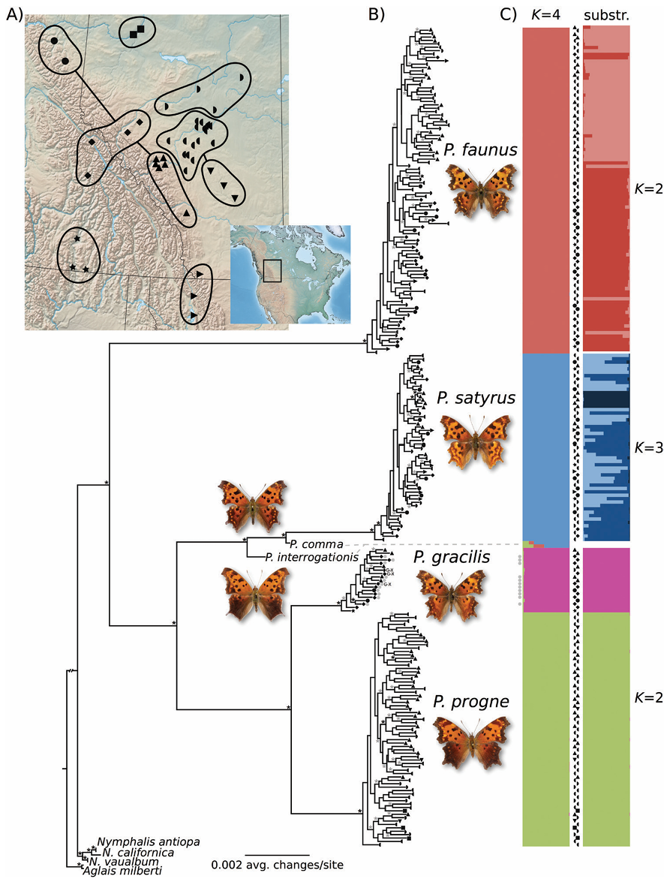
</p>

For our *delim-SOM* 2.0 reanalysis, we analyzed 200 individuals shared across the six data layers:

1. genome-wide SNPs from genotyping-by-sequencing (GBS)
2. mitochondrial COI
3. continuous morphology (wing-color measurements)
4. categorical morphology (visually scored wing characters and morphotype)
5. environmental variables
6. spatial variables

To follow this tutorial side-by-side, the files for this empirical example can be downloaded here:

```text
https://github.com/rpyron/delim-SOM/tree/dev2.0/Empirical_examples/Dupuis_et_al_2018
```


## 1. Set paths

First, we define the path to the directory containing the empirical example datasets.

```r
#### Set environment ###########################################################
example_dir <- file.path("Empirical_examples", "Dupuis_et_al_2018")
```


## 2. Import and process data for SOM analyses

In this section, we import, filter, process, and evaluate each data source to prepare the six data layers used for SOM training.


### 2.1 Import metadata

We first import the metadata.

```r
#### Import metadata ############################################################
Polygonia_metadata <- read.csv(file.path(example_dir, "Polygonia_metadata.csv"), header = TRUE, sep = ";")
rownames(Polygonia_metadata) <- Polygonia_metadata$ID
Polygonia_metadata <- dplyr::select(Polygonia_metadata, Species, ID, Latitude, Longitude, Morphotype)

dim(Polygonia_metadata)
head(Polygonia_metadata, n = 2)
```

We see that the metadata contains species identity, specimen ID, geographic coordinates, and morphotype information for 265 individuals.
Specimen identifiers are used as rownames and allow the metadata to be matched to the other data layers throughout the analysis.


```text
[1] 265   5
          Species      ID   Latitude Longitude Morphotype
8301 Polygonia faunus 8301   50.921  -114.527  Contrasted
8302 Polygonia faunus 8302   50.921  -114.527  Contrasted
```


### 2.2 Process genome-wide SNP data

We next import and process the VCF file containing GBS-derived genome-wide SNPs using `process.SNP.data.SOM()` with the recommended default settings. 
We then use `sub()` to simplify the rownames by retaining only the numeric specimen identifier, and evaluate the output.

```r
#### Process SNP data ##########################################################
Polygonia_SNP <- process.SNP.data.SOM(vcf.path = file.path(example_dir, "Polygonia_961SNPs.vcf"),
                                      missing.loci.cutoff.lenient = 0.7,
                                      missing.loci.cutoff.final = 0.5,
                                      missing.individuals.cutoff = 0.5)
rownames(Polygonia_SNP) <- sub(".*?(\\d+)$", "\\1", rownames(Polygonia_SNP))

dim(Polygonia_SNP)
print(Polygonia_SNP[1:2, 1:10])
```

This retains all 961 biallelic SNPs as variables (columns) from 237 of the original 241 individuals (rows), with four individuals removed due to more than 50% missing data:

```text
[1] 237 961
     SNP1 SNP2 SNP3 SNP4 SNP5 SNP6 SNP7 SNP8 SNP9 SNP10
8301    0    1    0    0    0    0    0    0    2     0
8302    0    0    0    0    0    0    0    0    2     0
```


### 2.3 Process mitochondrial COI data

Third, we import and process the aligned mitochondrial COI sequences. 
As before, we use `process.SNP.data.SOM()` with the recommended defaults to convert the sequence alignment to biallelic SNPs.
Then, we use `sub()` to retain only the numeric specimen identifier.
Duplicate specimen identifiers are removed and the output is evaluated.

```r
#### Process COI data ##########################################################
Polygonia_COI <- process.SNP.data.SOM(nexus.path = file.path(example_dir, "Polygonia_COI.nex"),
                                      missing.loci.cutoff.lenient = 0.7,
                                      missing.loci.cutoff.final = 0.5,
                                      missing.individuals.cutoff = 0.5)
Polygonia_COI_numeric_rownames <- sub(".*?(\\d+)$", "\\1", rownames(Polygonia_COI))
Polygonia_COI <- Polygonia_COI[!duplicated(Polygonia_COI_numeric_rownames), , drop = FALSE]
rownames(Polygonia_COI) <- Polygonia_COI_numeric_rownames[!duplicated(Polygonia_COI_numeric_rownames)]

dim(Polygonia_COI)
print(Polygonia_COI[1:2, 1:10])
```

This retains 213 biallelic COI variables or SNPs (columns) from the original 1,348 alignment sites and 255 individuals (rows) after removing 60 duplicate specimen identifiers:

```text
[1] 255 213
     SNP2 SNP3 SNP4 SNP5 SNP6 SNP7 SNP8 SNP9 SNP10 SNP11
8301    0    2    0    0    0    2    2    2     0     2
8302    0    2    0    0    0    2    2    2     0     2
```


### 2.4 Prepare continuous wing-color morphology

This section imports and processes the continuous morphology data containing RGB color measurements from six dorsal and ventral wing regions.
The specimen identifiers are used as rownames (confusingly stored as `Species` column in the original dataset), and the non-morphological `Name` and `Species` columns are removed.
We then filter the continuous wing-color variables for low variation and high pairwise absolute Spearman correlations using the defaults in `remove.lowCV.multicollinearity.SOM()`.
Lastly, we evaluate the output.

```r
#### Prepare continuous morphology ############################################
Polygonia_RGB <- read.delim(file.path(example_dir, "Polygonia_RGB_characters.txt"), stringsAsFactors = FALSE)
rownames(Polygonia_RGB) <- Polygonia_RGB$Species
Polygonia_RGB <- Polygonia_RGB[, !names(Polygonia_RGB) %in% c("Name", "Species"), drop = FALSE]
Polygonia_morphology <- remove.lowCV.multicollinearity.SOM(input.dataframe = Polygonia_RGB)

dim(Polygonia_morphology)
print(Polygonia_morphology[1:2, 1:10])
```

Filtering removes three of the original eighteen continuous wing-color variables (three RGB colors x six wing regions), resulting in fifteen variables (columns) for 237 individuals (rows): 

```text
[1] 237  15
        R11   G11   B11    R12    G12   B12    R13    G13   B13   G14
8301 107.67 49.73 17.70 159.34 105.67 24.43 168.71 116.31 26.65 49.20
8302 111.30 51.86 19.38 151.62  91.75 12.01 167.63 124.57 33.41 59.09
```

The figure below (Fig. 3 in Dupuis et al. 2018) shows the six dorsal and ventral wing regions (spots 11-16 in their figure) used for the RGB measurements and their average red, green, and blue luminance values for each species, with (c) and (s) denoting the contrasted and smeared morphotypes, respectively.

<p align="center">
  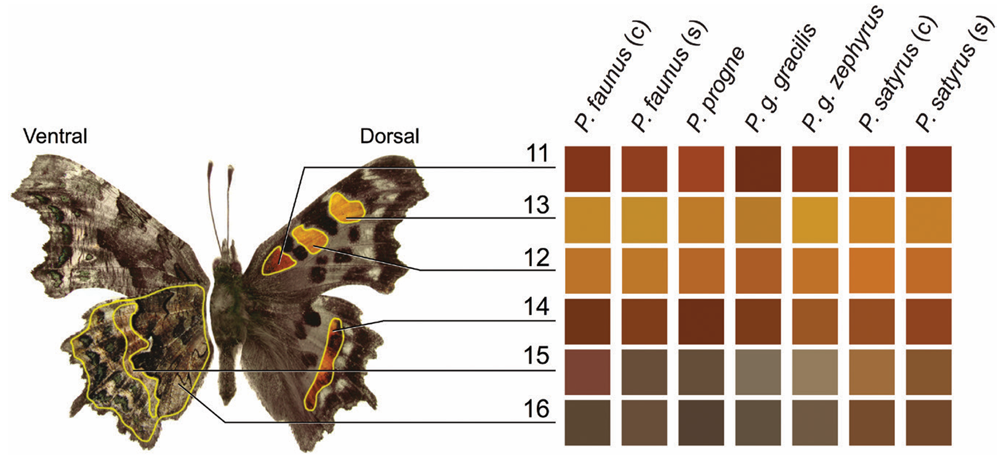
</p>


### 2.5 Prepare categorical wing morphology

We next import and process the visually scored wing characters and combine them with the morphotype data.

The figure below (Fig. 2 in Dupuis et al. 2018) shows the ten visually scored characters on the dorsal and ventral wing surfaces and the proportion of each character state across species.
The authors chose these characters and regions based on diagnostic features in field guides.
The labels 1–10 indicate the wing characters, while (c) and (s) denote the contrasted and smeared morphotypes, respectively.
Most characters are binary, but three are ordinal (spots 1, 4, 5) and one is nominal (spot 8).

<p align="center">
  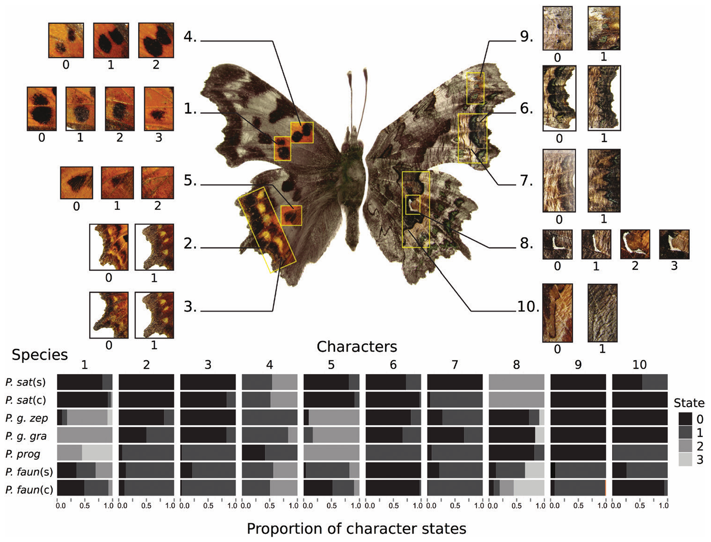
</p>

We first import the visually scored wing characters and use the specimen identifiers as rownames.
We remove the `Name` and `Species` columns and rename the ten wing characters for clarity.
The binary and ordinal characters are left untouched.
However, we treat wing character 8 as nominal and therefore convert its four states into four binary indicator variables and remove the original wing character 8 variable.

```r
#### Prepare categorical morphology ###########################################
Polygonia_wing_scores <- read.delim(file.path(example_dir, "Polygonia_visually_scored.txt"), stringsAsFactors = FALSE)
rownames(Polygonia_wing_scores) <- Polygonia_wing_scores$Name
Polygonia_wing_scores <- Polygonia_wing_scores |>
  dplyr::select(-Name, -Species) |>
  dplyr::rename(Wing_character_1 = Ch1,
                Wing_character_2 = Ch2,
                Wing_character_3 = Ch3,
                Wing_character_4 = Ch4,
                Wing_character_5 = Ch5,
                Wing_character_6 = Ch6,
                Wing_character_7 = Ch7,
                Wing_character_8 = Ch8,
                Wing_character_9 = Ch9,
                Wing_character_10 = Ch10)
Polygonia_wing_scores$Wing_character_8 <- factor(Polygonia_wing_scores$Wing_character_8, levels = 1:4)
Wing_character_8_states <- stats::model.matrix(~ Wing_character_8 - 1, data = Polygonia_wing_scores)
colnames(Wing_character_8_states) <- paste0("Wing_character_8_state_", 1:4)
Polygonia_wing_scores <- cbind(Polygonia_wing_scores, Wing_character_8_states)
Polygonia_wing_scores$Wing_character_8 <- NULL
```

Morphotype data are then extracted from the metadata.
We ensure that the specimen identifiers of both datasets are stored as character rownames and combine the wing-character and morphotype data using their shared specimen identifiers.
The shared specimen identifiers are restored as rownames after merging.
Finally, morphotype is converted into binary indicator variables using `make.cols.binary.SOM()` with `append.to.original = TRUE`, and the original morphotype variable is removed.

```r
Polygonia_morphotype <- Polygonia_metadata[, "Morphotype", drop = FALSE]
rownames(Polygonia_wing_scores) <- as.character(rownames(Polygonia_wing_scores))
rownames(Polygonia_morphotype) <- as.character(rownames(Polygonia_morphotype))
Polygonia_morphology_categorical <- merge(Polygonia_wing_scores,
                                          Polygonia_morphotype,
                                          by = "row.names",
                                          all = FALSE)
rownames(Polygonia_morphology_categorical) <- Polygonia_morphology_categorical$Row.names
Polygonia_morphology_categorical$Row.names <- NULL
Polygonia_morphology_categorical <- make.cols.binary.SOM(dataframe = Polygonia_morphology_categorical,
                                                         make.binary.cols = "Morphotype",
                                                         append.to.original = TRUE)
Polygonia_morphology_categorical$Morphotype <- NULL

dim(Polygonia_morphology_categorical)
print(Polygonia_morphology_categorical[1:2, 1:6])
```

This results in fifteen categorical morphology variables (columns) for 217 individuals (rows):

```text
[1] 217  15
     Wing_character_1 Wing_character_2 Wing_character_3 Wing_character_4 Wing_character_5 Wing_character_6
8301                2                2                2                2                1                1
8302                2                2                2                2                1                2
```


### 2.6 Prepare spatial data

Dupuis et al. (2018) did not include spatial data in their analyses.
However, because they provided specimen coordinates, we could add a spatial layer to our reanalysis.

Here, we first extract latitude and longitude from the metadata.
We then use the `st_as_sf()` function in the *sf* package (Pebesma 2018; Pebesma & Bivand 2023) to convert these coordinates into spatial points and the `get_elev_point()` function in the *elevatr* package (Hollister 2025) to retrieve elevation for each specimen locality.

```r
#### Prepare spatial data ######################################################
Polygonia_spatial <- Polygonia_metadata[, c("Latitude", "Longitude"), drop = FALSE]
Polygonia_spatial$Elevation <- NA
Polygonia_spatial_sf <- sf::st_as_sf(Polygonia_spatial[!is.na(Polygonia_spatial$Latitude) & !is.na(Polygonia_spatial$Longitude), ],
                                     coords = c("Longitude", "Latitude"),
                                     crs = 4326)
Polygonia_spatial$Elevation[!is.na(Polygonia_spatial$Latitude) & !is.na(Polygonia_spatial$Longitude)] <-
  elevatr::get_elev_point(locations = Polygonia_spatial_sf,
                          prj = sf::st_crs(Polygonia_spatial_sf)$proj4string,
                          src = "aws")$elevation

dim(Polygonia_spatial)
print(Polygonia_spatial[1:2, , drop = FALSE])
```

This results in three spatial variables (columns) for 265 individuals (rows):

```text
[1] 265   3
     Latitude Longitude Elevation
8301   50.921  -114.527      1343
8302   50.921  -114.527      1343
```


### 2.7 Prepare environmental data

Dupuis et al. (2018) did not include environmental data in their study.
For our reanalysis, we added an environmental layer by extracting a comprehensive set of environmental variables with the aid of the novel *NicheDiv* *R* package (Schönberger et al. 2026) based on their provided specimen coordinates.

Here, we import this dataset and remove latitude, longitude, and elevation (because they are analyzed separately in the spatial layer).

```r
#### Prepare environmental data ################################################
Polygonia_environmental <- read.csv(file.path(example_dir, "Polygonia_environmental.csv"), row.names = 1, header = TRUE)
Polygonia_environmental <- Polygonia_environmental[, !names(Polygonia_environmental) %in% c("Latitude", "Longitude", "Elevation"), drop = FALSE]
Polygonia_environmental_rownames <- rownames(Polygonia_environmental)
Polygonia_environmental <- as.data.frame(lapply(Polygonia_environmental, as.numeric))
rownames(Polygonia_environmental) <- Polygonia_environmental_rownames
```
We then transform skewed environmental variables using `transform.skewed.variables()` in the *NicheDiv* *R* package (Schönberger et al. 2026). 
This function automatically checks each variable for skewness and applies the most appropriate transformation if skewed.
As above for the continuous morphology data, we subsequently remove variables with low variation or strong pairwise correlations using `remove.lowCV.multicollinearity.SOM()`.

```r
Polygonia_environmental <- NicheDiv::transform.skewed.variables(Polygonia_environmental)$transformed
Polygonia_environmental <- remove.lowCV.multicollinearity.SOM(input.dataframe = Polygonia_environmental)

dim(Polygonia_environmental)
print(Polygonia_environmental[1:2, 1:10])
```

After filtering, 125 environmental variables (columns) of the original 309 are retained for 265 individuals (rows).
We can also see the applied transformations for some variables from the appended suffixes in their names (e.g., `_log` or `_sqrt`).

```text
[1] 265 125
     CMD_sqrt  PAS_log RH Tmax02 Tmax04 Tmax09 Tmax10_log Tmax11 Tmin11_log1p_shifted PPT01_log
8301 12.72792 4.828314 53   -0.7    9.5   17.9   2.360854    3.7             1.740466   2.70805
8302 12.72792 4.828314 53   -0.7    9.5   17.9   2.360854    3.7             1.740466   2.70805
```


## 3. SOM training

All datasets are now ready for SOM training.
We combine the six processed layers into a named list, which can then be supplied to `train.SOM()`.
This function first checks the data, removes any remaining zero-variance variables, constructs the SOM grid, and then trains replicate SOMs.
It also automatically matches and retains individuals shared across all layers and prints messages summarizing each processing and training step.

Here, we use the recommended default settings.
Individuals and variables containing more than 50% missing data are removed using `max.NA.row = 0.5` and `max.NA.col = 0.5`, respectively.
Training for this dataset takes around 3–10 min.

```r
#### Train SOM #################################################################
Polygonia_all_data <- list(Morphology = Polygonia_morphology,
                           Morphology_2 = Polygonia_morphology_categorical,
                           SNP = Polygonia_SNP,
                           COI = Polygonia_COI,
                           Environmental = Polygonia_environmental,
                           Spatial = Polygonia_spatial)
Polygonia_SOM_tr <- train.SOM(input_data = Polygonia_all_data,
                              max.NA.row = 0.5,
                              max.NA.col = 0.5)
```


## 4. Cluster SOM codebook vectors

After SOM training, we cluster the resultant codebook vectors using the recommended `"kmeans+BICelbow"` approach.
The optimal K is selected for each SOM replicate, allowing support for alternative K values to be summarized across replicates.
Clustering for this dataset takes around 2–7 min.
We can then evaluate the support for each K using the `$optim_k_summary` component of the output object.

```r
#### Cluster SOM ###############################################################
Polygonia_SOM <- clustering.SOM(SOM.output = Polygonia_SOM_tr,
                                clustering.method = "kmeans+BICelbow")
Polygonia_SOM$optim_k_summary
```

This analysis reveals strong support for K = 3, with support for K = 4 in 12% of SOM replicates:

```text
K = 3: 88%
K = 4: 12%
```


## 5. Evaluate results

After SOM training and clustering, *delim-SOM* 2.0 offers several functions to evaluate and plot the results.


### 5.1 Learning trajectories

`plot.learning.SOM()` is a diagnostic function to assess changes during SOM training across replicates and data layers.

Below, we see an initial decline followed by a stable plateau at the end for each layer, which suggests that SOM learning has converged toward a stable representation.
Erratic trajectories or continued changes late in training would indicate that additional training steps are needed or that the input data require further inspection.
We also note that the absolute heights and slopes of trajectories can differ among data layers.
This is expected because layers differ in dimensionality, distance functions, and distance distributions.
These differences should not be interpreted as layer importance.

```r
plot.learning.SOM(Polygonia_SOM)
```

<p align="center">
  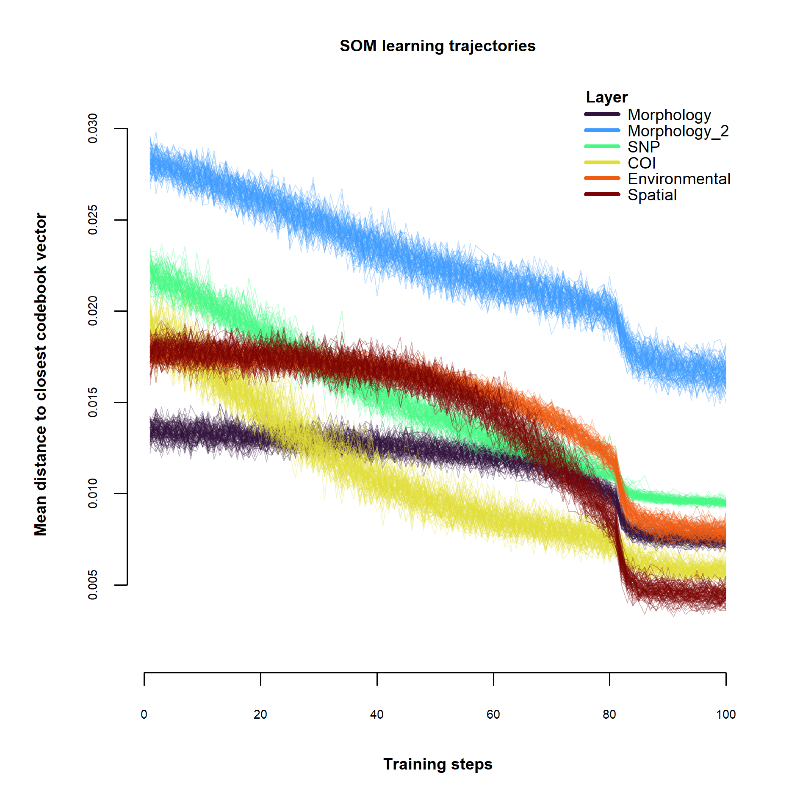
</p>


### 5.2 Layer distance scales

`plot.layer.distance.scale.SOM()` visualizes the average pairwise distance scale of each input layer before SOM training and internal distance normalization.
This plot is a diagnostic of differences in raw distance scale among layers (representing both the number of variables and their variances).
Notably, raw distance scales should not be interpreted as measures of layer importance.

Below, we see that the genomic layer strongly dominates the raw distance scale. 
This pattern is typical for many empirical datasets (Schönberger et al. preprint).
Importantly, the internal distance normalization in `train.SOM()` downweights such layers and upweights layers with smaller raw distance scales, preventing these differences from automatically determining their contribution during training.

```r
plot.layer.distance.scale.SOM(Polygonia_SOM)
```

<p align="center">
  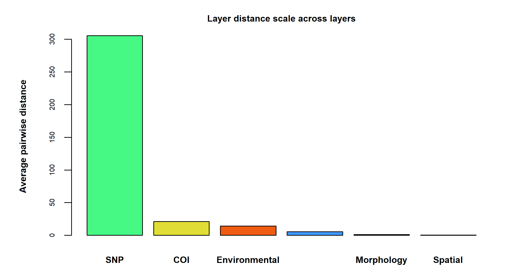
</p>


### 5.3 Support for alternative K values

`plot.K.SOM()` is an important function to evaluate relative support for alternative K values.
It visualizes the support profile across candidate K values, successive changes in BIC, and the frequency with which each K was selected across retained SOM replicates.

The full support profile should be considered rather than relying only on the most frequently selected K.
Support for multiple K values indicates uncertainty in the inferred number of candidate lineages, which could arise from weak differentiation, recent divergence, admixture, or discordance among layers.

In our empirical example below, we see a clear BIC elbow between K = 3 and K = 4 (top), with the largest ΔBIC improvement occurring at K = 3 and much smaller improvements thereafter (middle).
This resulted in K = 3 being selected in 88% of SOM replicates and K = 4 in 12% (bottom).

```r
plot.K.SOM(Polygonia_SOM)
```

<p align="center">
  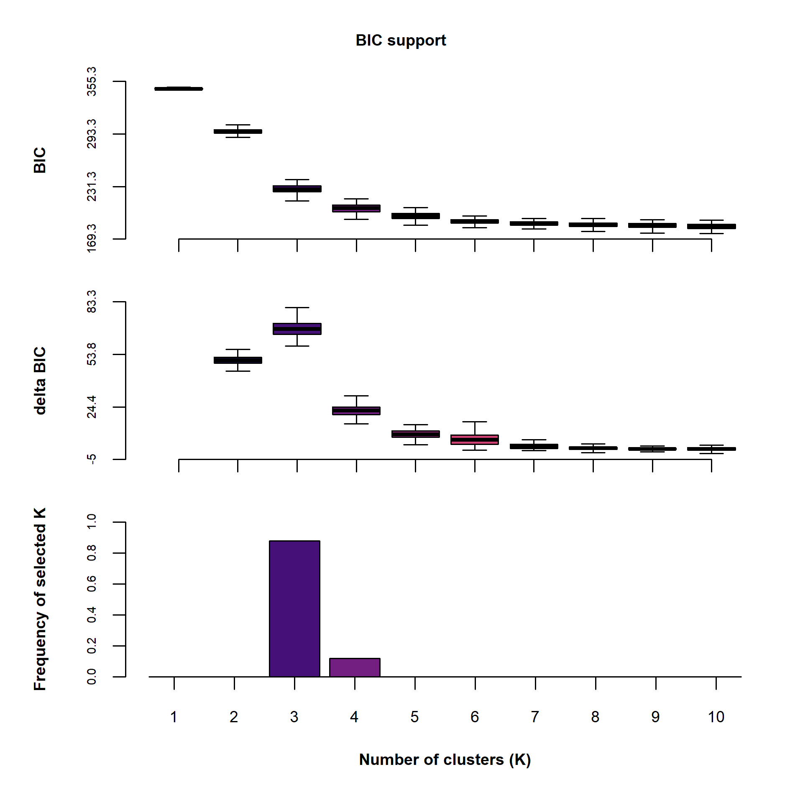
</p>


### 5.4 Visualize SOM topology and candidate lineages

We next plot the trained SOM topology and inferred candidate lineages using `plot.model.SOM()`.

With the recommended `replicate.mode = "representative"`, this is done for a representative replicate rather than simply the first or a random replicate.
The representative replicate is selected by first identifying the most frequently inferred K across retained replicates and then, among replicates supporting that K, choosing the replicate with the highest mean pairwise Adjusted Rand Index relative to the other candidate replicates.

The top neighbor-distance panel is a U-matrix plot commonly used in SOM studies (Ultsch 1993; Vesanto & Alhoniemi 2000; Wehrens & Buydens 2007) that shows the distances among adjacent SOM cells.
Darker areas indicate relatively large distances between adjacent codebook vectors and mark boundaries (“ridges”) between groups. 
Light areas indicate lower-distance “valleys,” representing more internally similar areas of the map.
Supported candidate lineages are expected to occupy these lighter valleys separated from one another by darker ridges.

The bottom clustering panel shows the inferred candidate-lineage boundaries for the same representative replicate.
Individuals are shown at the cells to which they were mapped, and the red boundaries separate the inferred candidate lineages.
Contiguous cluster regions indicate strong correspondence between the inferred clustering and the learned SOM topology.
Fragmented cluster regions with the same inferred cluster occurring in disconnected parts of the map indicate reduced topological coherence and can reflect imperfect preservation of the underlying multivariate structure or a fine clustering solution.

Below, we clearly see three yellow valleys that are distinctly separated by dark-blue ridges that correspond closely to the inferred candidate-lineage boundaries in the bottom plot. 
This strongly supports the three inferred candidate lineages and provides a great example of a coherent SOM topology with well-defined and contiguous cluster structure.
In other empirical datasets, the ridges are often less distinct, the valleys more fragmented, or transitions between candidate lineages more gradual (Schönberger et al. preprint).
Another characteristic visible in the plot is that some cells contain no mapped individuals.
This is not unusual and is generally not concerning because the grid represents a smoothed topological surface of the data, so that empty or sparsely occupied cells can occur between more strongly occupied regions.

```r
plot.model.SOM(Polygonia_SOM, replicate.mode = "representative")
```

<p align="center">
  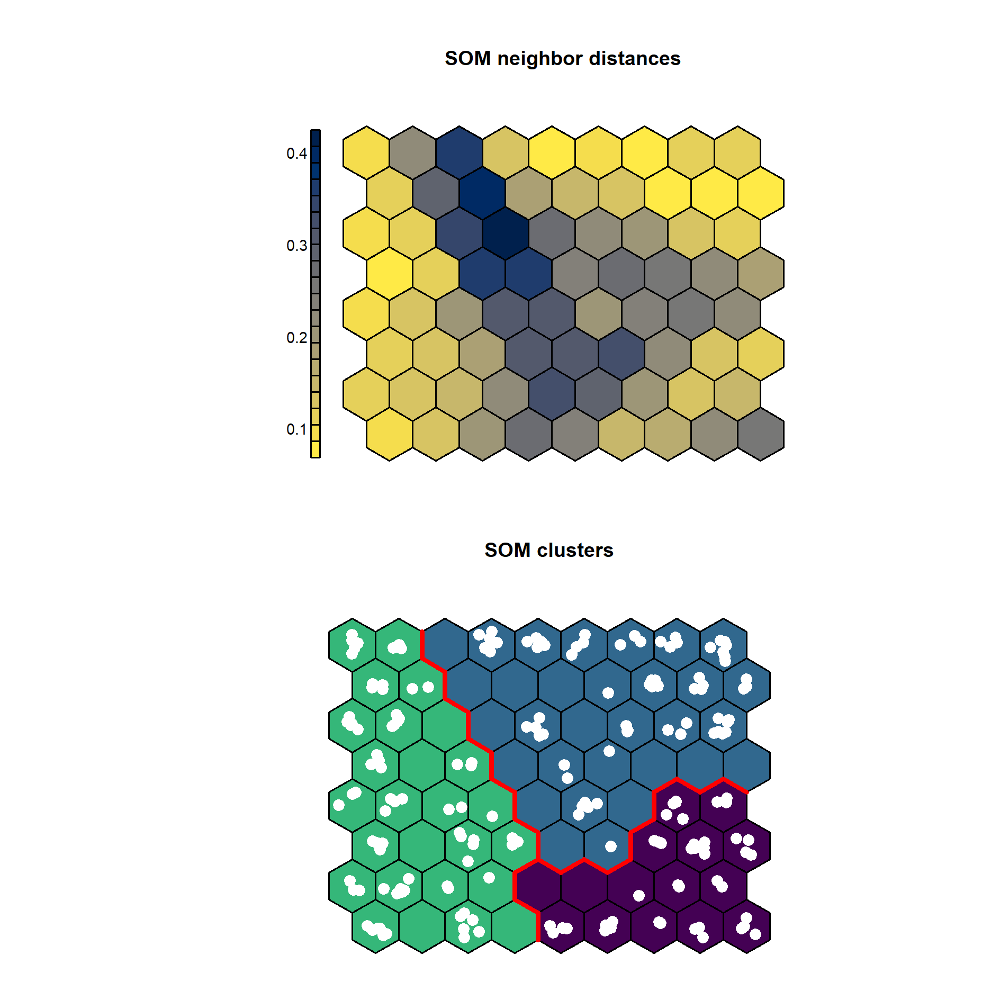
</p>


We can also examine the same plot for the alternative, less-supported K = 4 solution using `set.k`.
This restricts the visualization to replicates in which four clusters were inferred and determines the representative replicate from this subset.

The plot below shows that the K = 4 solution provides a less clear example of correspondence between the neighbor-distance topology and the inferred clustering.
The four inferred clusters remain fully contiguous in the bottom panel, but the upper panel shows less distinct valleys and more fragmented ridges, with several cluster boundaries lacking a strong corresponding neighbor-distance boundary.
This weaker correspondence is consistent with the lower support for K = 4.

```r
plot.model.SOM(Polygonia_SOM,
               replicate.mode = "representative",
               set.k = 4)
```

<p align="center">
  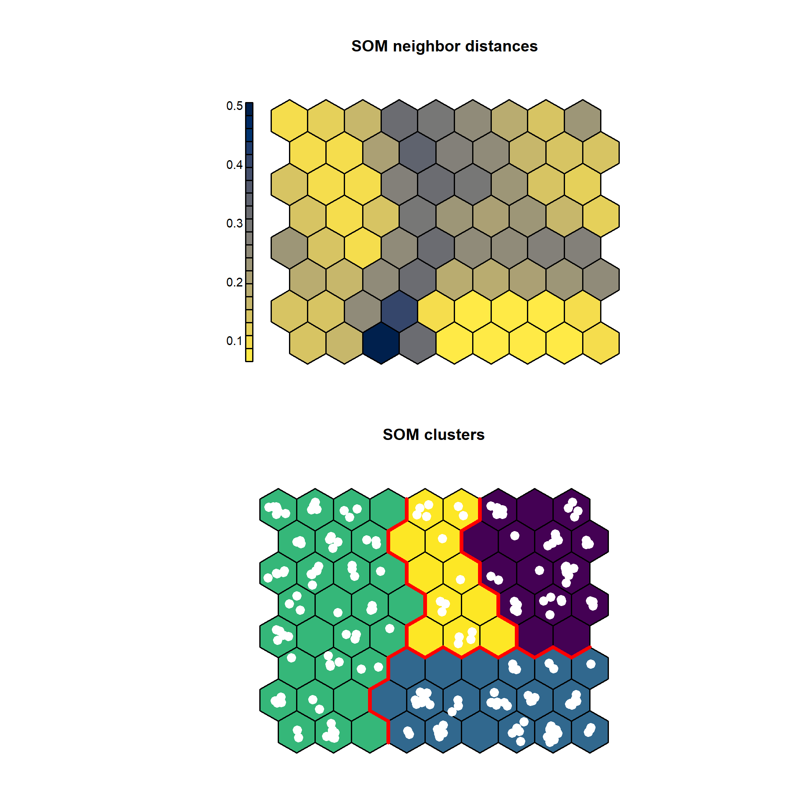
</p>


### 5.5 Plot replicate-consensus assignments

`plot.structure.SOM()` provides a visualization similar to *STRUCTURE* bar plots (Pritchard et al. 2000) using replicate-consensus assignment coefficients.
Each bar represents one individual and summarizes how consistently that individual is assigned to each candidate lineage across SOM replicates.
Assignments distributed across multiple clusters indicate that an individual is placed inconsistently among candidate lineages across replicates.
Such intermediate assignments may indicate weak lineage differentiation associated with admixture or discordance among data sources, while a similar pattern across many individuals may also be consistent with recent divergence.

Here, we use `bottom.margin` to adjust the lower plot margin for the individual labels.
The plot shows four cluster components rather than only the more frequently recovered K = 3 solution because the function summarizes assignments across all retained replicates across all K.
Overall, we see three major clusters, with most individuals showing highly consistent assignments to one of the three major candidate lineages, thus reflecting the predominant K = 3 solution.
The fourth cluster occurs only as a relatively small assignment component in a subset of individuals, consistent with the less-supported K = 4 solution in 12% of replicates.

```r
plot.structure.SOM(Polygonia_SOM, bottom.margin = 3.5)
```
<p align="center">
  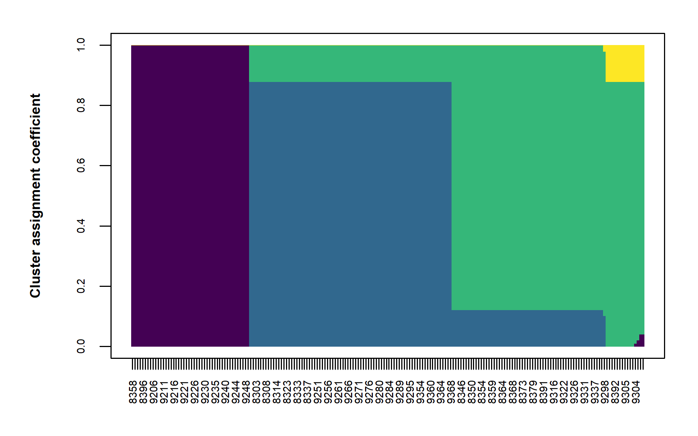
</p>

We can also extract and evaluate the replicate-consensus cluster assignment coefficients.
These are stored in the `$ancestry_matrix` component of the clustering output.
Furthermore, it is often useful to combine these coefficients with species labels to compare the inferred candidate-lineage assignments with existing species hypotheses.

In our example, the individual IDs are stored as rownames in both the ancestry matrix and `Polygonia_metadata` so we can match the species names to the corresponding individuals.
We can then inspect the dataframe:
  
  ```r
head(Polygonia_SOM$ancestry_matrix)
Polygonia_ancestry <- as.data.frame(Polygonia_SOM$ancestry_matrix)
Polygonia_ancestry$Species <- Polygonia_metadata$Species[match(rownames(Polygonia_ancestry), rownames(Polygonia_metadata))]
head(Polygonia_ancestry)
```
```text
        Cluster_1   Cluster_2  Cluster_3   Cluster_4     Species
8301         0      0.8787879  0.1212121       0    Polygonia faunus
8302         0      0.8787879  0.1212121       0    Polygonia faunus
8303         0      0.8787879  0.1212121       0    Polygonia faunus
8304         0      0.8787879  0.1212121       0    Polygonia faunus
8306         0      0.8787879  0.1212121       0    Polygonia faunus
8307         0      0.8787879  0.1212121       0    Polygonia faunus
```

Evaluating this data frame together with the STRUCTURE-like barplot reveals that the purple and blue clusters correspond to *P. satyrus* (purple) and *P. faunus* (blue), respectively. 
However, *P. gracilis* and *P. progne* are both predominantly assigned to the green cluster, corresponding to a single candidate lineage.
These two species are separated only by a small proportion of replicates, with *P. gracilis* receiving the yellow and *P. progne* the blue cluster component.


### 5.6 Plot geographic assignments

`plot.map.SOM()` displays replicate-consensus assignment coefficients as pie charts at the geographic coordinates of each individual.
This function requires two inputs:
the SOM output object (`Polygonia_SOM`) and a data frame containing the sample coordinates with rownames matching those in the SOM output (`Polygonia_spatial`).
The function automatically matches the rownames and only plots shared individuals.

As shown below, additional plotting arguments are available and may require some fine-tuning to create an aesthetic map.
In our case, the four *Polygonia* species are broadly sympatric, making this plot is less informative for distinguishing their geographic distributions due to the overlapping pie charts.

```r
plot.map.SOM(SOM.output = Polygonia_SOM,
             Coordinates = Polygonia_spatial[, c("Latitude", "Longitude")],
             lat.buffer.range = 4,
             lon.buffer.range = 10,
             pie.size = 1.4,
             north.arrow.position = c(0.04, 0.87),
             north.arrow.length = 1.0,
             north.arrow.N.position = 0.4,
             north.arrow.N.size = 1,
             scale.position = c(0.75, 0.07))
```

<p align="center">
  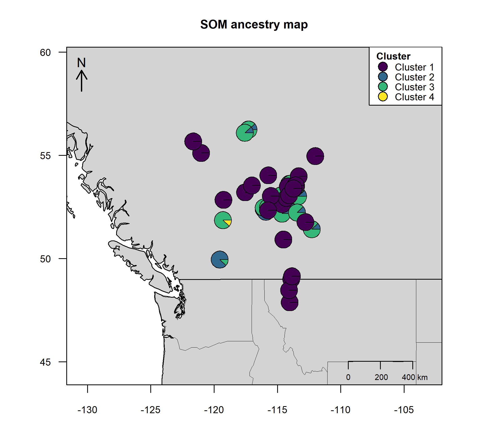
</p>


### 5.7 Evaluate variable importance

`clustering.SOM()` calculates two complementary measures of variable importance that can be visualized using `plot.variable.importance.SOM()`.

First, `mode = "Cluster.separation"` visualizes cluster-separation importance and is generally the more relevant measure for identifying which variables distinguish the inferred candidate lineages.
It uses an ANOVA-like η² effect size to quantify how strongly each variable is associated with separation among the inferred clusters.
Higher η² values indicate that a larger proportion of variation in that variable is associated with the inferred cluster structure.
Note that η² provides an overall measure of cluster separation and does not indicate which specific clusters a variable separates most strongly.

Here, we use `bottom.margin` and `left.margin` to adjust the plot margins depending on the length of the variable labels.
We also use `bars.threshold.N` to set the threshold for omitting variable labels and boxplot whiskers for layers containing more than twenty displayed variables.
This allows large layers such as SNP datasets to be visualized more clearly.

```r
plot.variable.importance.SOM(Polygonia_SOM,
                             mode = "Cluster.separation",
                             bars.threshold.N = 20,
                             bottom.margin = 2,
                             left.margin = 5.8)
```

<p align="center">
  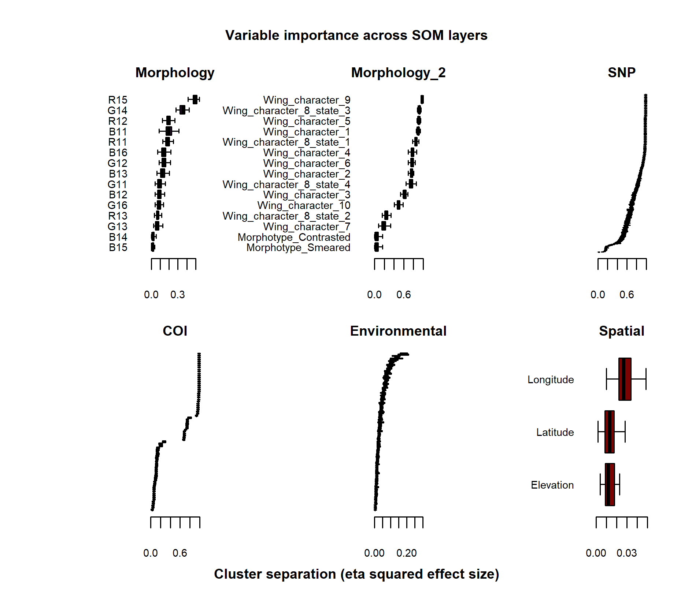
</p>


Second, `mode = "Map.variance"` visualizes map-variance importance, which quantifies how strongly each variable varies across the trained SOM map (i.e., irrespective of whether this variation corresponds directly to the cluster boundaries).
Higher values indicate greater variation in a variable across the map.
Map variance is primarily intended as a complementary measure to cluster-separation importance:
if a variable shows both high η² cluster-separation importance and map variance, this provides additional evidence for its importance because the variable both varies strongly across the map and is aligned with the inferred cluster structure.
Map variance is also particularly useful when K = 1, since cluster-separation importance cannot be calculated in this case (because no between-cluster partition exists). 

As above, we use `bottom.margin`, `left.margin`, and `bars.threshold.N` to modify the plot.

```r
plot.variable.importance.SOM(Polygonia_SOM,
                             mode = "Map.variance",
                             bars.threshold.N = 20,
                             bottom.margin = 2,
                             left.margin = 5)
```

<p align="center">
  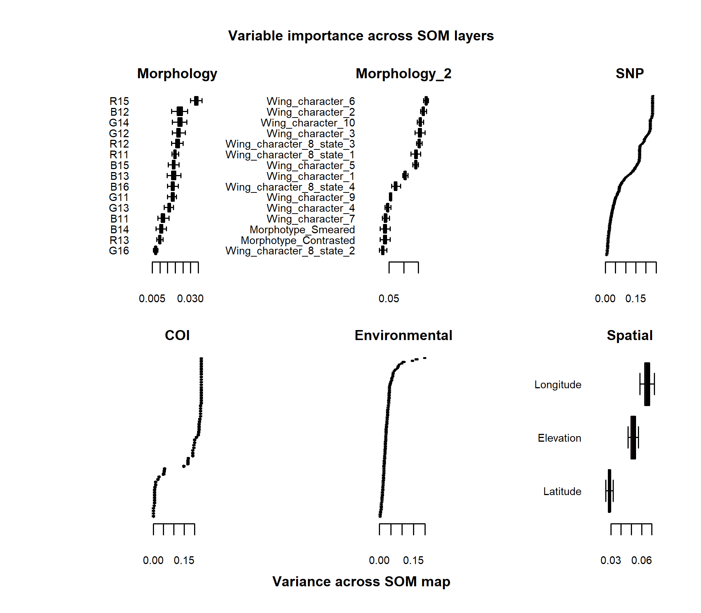
</p>

The variable-importance values can also be inspected directly in the clustering output using the `median_etasquared_variable_importance` component for cluster separation and the `median_map_variance_variable_importance` component for map variance.
For example, we can extract the ten variables with the highest median cluster-separation importance from individual data layers.
Here, `sort()` orders the variables by their importance values and `decreasing = TRUE` places the most important variables first, `head()` retains only the first ten variables, and `round()` rounds the resulting importance values to two decimal places.

For the continuous RGB wing color layer:

```r
round(head(sort(Polygonia_SOM$median_etasquared_variable_importance[[1]], decreasing = TRUE), 10), 2)
```

```text
 R15  G14  R12  B11  R11  B16  G12  B13  G11  B12 
0.49 0.36 0.20 0.19 0.19 0.14 0.14 0.12 0.09 0.09
```

For the categorical morphology layer:

```r
round(head(sort(Polygonia_SOM$median_etasquared_variable_importance[[2]], decreasing = TRUE), 10), 2)
```

```text
        Wing_character_9 Wing_character_8_state_3         Wing_character_5 
                    0.97                     0.92                     0.91 
        Wing_character_1 Wing_character_8_state_1         Wing_character_4 
                    0.90                     0.85                     0.77 
        Wing_character_6         Wing_character_2 Wing_character_8_state_4 
                    0.76                     0.76                     0.76 
        Wing_character_3 
                    0.61
```


### 5.8 Evaluate layer importance

*delimSOM* 2.0 provides two complementary ways to assess layer importance: by summarizing variable importance within each layer and by measuring how the inferred clustering changes when individual layers are omitted.

First, `plot.layer.importance.varimp.SOM()` summarizes the distributions of variable-importance values (presented above in section 5.7) within each data layer.
This allows the relative importance of the different data layers to be compared based on how strongly their variables are associated with cluster separation or variation across the SOM map.

When examining this plot, it is important to consider the number of variables within each layer.
Layers with few variables (e.g. the spatial layer) may show wide boxplots, but this apparently large variation is based on only a small number of variables.
We use `bottom.margin` to adjust the bottom plot margin according to the length of the layer names.

```r
plot.layer.importance.varimp.SOM(Polygonia_SOM, bottom.margin = 3.5)
```

<p align="center">
  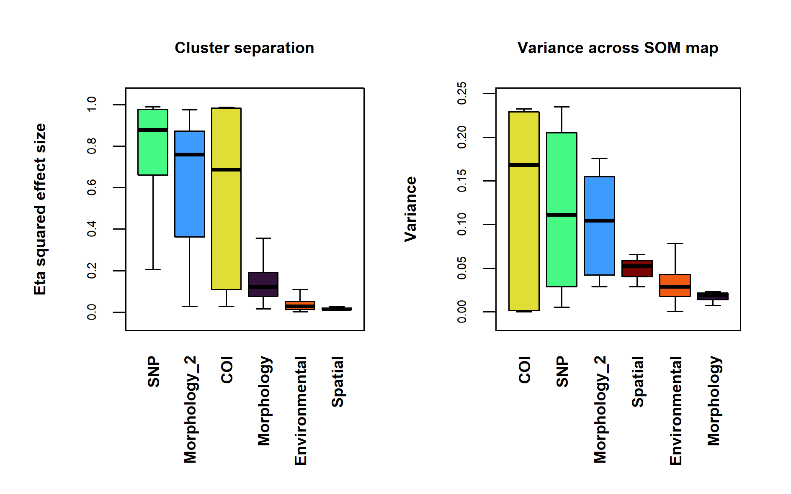
</p>

Second, `plot.layer.importance.leaveoneout.SOM()` performs a leave-one-layer-out analysis by rerunning the analysis while omitting one data layer at a time and comparing each reduced analysis with the full multilayer SOM.

This provides a more direct assessment of how strongly each layer affects the inferred number of clusters, cluster composition, and individual assignment confidence after each layer is omitted. 
If a layer is important, its omission should produce larger changes in these measures.
Because SOM training and clustering are repeated for each omitted layer, this analysis is computationally very intensive and might take a couple of hours depending on the scale of the dataset.

The plot contains three complementary measures of layer importance.
The left panel shows the absolute change in the inferred number of clusters (K) after each layer is omitted, with larger values indicating that the omitted layer had a stronger influence on the number of candidate lineages recovered.
The middle panel shows the pairwise co-assignment change, which is the proportion of pairs of individuals whose same-cluster versus different-cluster relationship changes after omitting the layer. Larger values therefore indicate that removing the layer more strongly changes which individuals are grouped together.
The right panel shows the change in mean assignment margin, where the assignment margin is the difference between the highest and second-highest cluster-assignment values for each individual. Positive values indicate that omitting the layer reduces assignment confidence, whereas values near zero indicate little change.
For all three panels, larger values indicate greater importance of the omitted layer for the inferred delimitation, while values close to zero indicate that removing the layer has little effect on the clustering.
Points represent replicate-matched comparisons between the full analysis and the corresponding leave-one-layer-out analysis, while the boxplots summarize variation across SOM replicates.


```r
plot.layer.importance.leaveoneout.SOM(Polygonia_SOM,
                                      bottom.margin = 7)
```

<p align="center">
  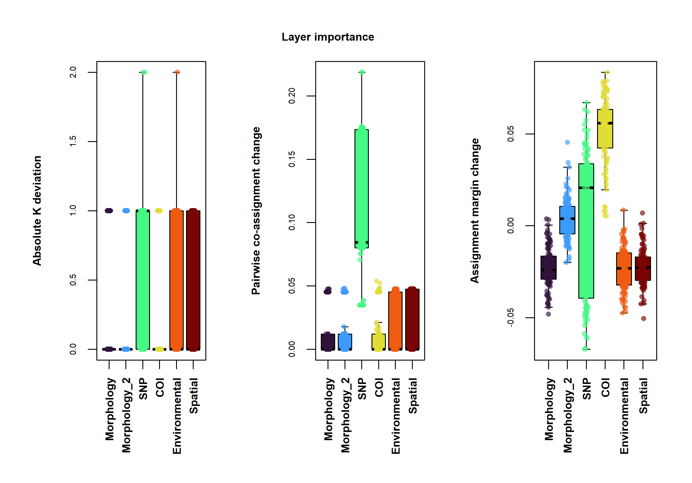
</p>


## 6. Hierarchical reanalysis

Hierarchical reanalysis can be used to test for additional structure within each recovered main candidate lineage (Janes et al. 2017).
For the *Polygonia* example, we first assign each individual to the candidate lineage with the highest ancestry proportion using `apply()`.
We then rename the clusters using `paste0()` and split the samples by cluster using `split()`.

```r
#### Hierarchical reanalysis ###################################################
Polygonia_clusters <- apply(Polygonia_SOM$ancestry_matrix, 1, which.max) #assign each sample to cluster with highest ancestry proportion
Polygonia_clusters <- paste0("cluster", Polygonia_clusters) #rename clusters
table(Polygonia_clusters)
Polygonia_cluster_samples <- split(rownames(Polygonia_SOM$ancestry_matrix), Polygonia_clusters)
```

As we have seen before, the main *Polygonia* analysis recovered three candidate lineages (K = 3).
We can subset each candidate lineage from the original input data using `lapply()` and rerun the SOM training and clustering workflow:

```r
Polygonia_cluster1_data <- lapply(Polygonia_SOM$input_data, function(x) x[Polygonia_cluster_samples$cluster1, , drop = FALSE]) #cluster 1 subset
Polygonia_cluster2_data <- lapply(Polygonia_SOM$input_data, function(x) x[Polygonia_cluster_samples$cluster2, , drop = FALSE]) #cluster 2 subset
Polygonia_cluster3_data <- lapply(Polygonia_SOM$input_data, function(x) x[Polygonia_cluster_samples$cluster3, , drop = FALSE]) #cluster 3 subset


Polygonia_SOM_tr_cluster1 <- train.SOM(Polygonia_cluster1_data,
                                       max.NA.row = 0.5,
                                       max.NA.col = 0.5)
Polygonia_SOM_cluster1 <- clustering.SOM(Polygonia_SOM_tr_cluster1,
                                         clustering.method = "kmeans+BICelbow")
Polygonia_SOM_cluster1$optim_k_summary


Polygonia_SOM_tr_cluster2 <- train.SOM(Polygonia_cluster2_data,
                                       max.NA.row = 0.5,
                                       max.NA.col = 0.5)
Polygonia_SOM_cluster2 <- clustering.SOM(Polygonia_SOM_tr_cluster2,
                                         clustering.method = "kmeans+BICelbow")
Polygonia_SOM_cluster2$optim_k_summary

Polygonia_SOM_tr_cluster3 <- train.SOM(Polygonia_cluster3_data,
                                       max.NA.row = 0.5,
                                       max.NA.col = 0.5)
Polygonia_SOM_cluster3 <- clustering.SOM(Polygonia_SOM_tr_cluster3,
                                         clustering.method = "kmeans+BICelbow")
Polygonia_SOM_cluster3$optim_k_summary
```

These hierarchical analyses show that clusters 1 and 2 each recovered K = 1 with 100% support, whereas cluster 3 recovered K = 2 with 100% support. 
This indicates no further subdivision within the first two clusters, but additional structure within the third.

We can visualize the results of any resulting subclusters using the same functions as for the primary analysis.
Here, we do that for cluster 3.

```r
plot.model.SOM(Polygonia_SOM_cluster3, replicate.mode = "representative")
plot.structure.SOM(Polygonia_SOM_cluster3, bottom.margin = 9.5)
plot.K.SOM(Polygonia_SOM_cluster3)
plot.map.SOM(SOM.output = Polygonia_SOM_cluster3,
             Coordinates = Polygonia_spatial[, c("Latitude", "Longitude")],
             lat.buffer.range = 5,
             lon.buffer.range = 5,
             pie.size = 1.5,
             north.arrow.position = c(0.04, 0.89),
             north.arrow.length = 1,
             north.arrow.N.position = 0.3,
             north.arrow.N.size = 1)
plot.variable.importance.SOM(Polygonia_SOM_cluster3, mode = "Cluster.separation", left.margin = 5)
plot.variable.importance.SOM(Polygonia_SOM_cluster3, mode = "Map.variance", left.margin = 5)
plot.layer.importance.varimp.SOM(Polygonia_SOM_cluster3, bottom.margin = 3.5)
plot.layer.importance.leaveoneout.SOM(Polygonia_SOM_cluster3, bottom.margin = 6.5)
```
It is also often useful to compare the species composition of the hierarchical subclusters with the original taxonomic assignments to determine whether the additional structure corresponds to previously recognized species.

In our case, this comparison shows that cluster 3 contains the two species *Polygonia gracilis* and *P. progne*, which were grouped into a single candidate lineage in our primary analysis.
The hierarchical reanalysis therefore detected additional structure within this broader candidate lineage.

```r
Polygonia_ancestry_SOM_cluster3 <- as.data.frame(Polygonia_SOM_cluster3$ancestry_matrix)
Polygonia_ancestry_SOM_cluster3$Species <- Polygonia_metadata$Species[match(rownames(Polygonia_SOM_cluster3$ancestry_matrix), rownames(Polygonia_metadata))]

length(unique(Polygonia_ancestry_SOM_cluster3$Species))
table(Polygonia_ancestry_SOM_cluster3$Species)
```

```text
[1] 3
Polygonia gracilis gracilis     Polygonia gracilis zephyrus     Polygonia progne 
            8                                 9                         58
```


# C) Advanced settings and further recommendations

## Important considerations

- Ensure that rownames uniquely and consistently identify individuals across all layers
- Encode missing values as `NA`
- Preprocess variables to transform skewness and remove low-information and strongly redundant predictors
- Inspect support across alternative values of K rather than relying only on the most frequently selected K
- Treat inferred clusters as candidate-lineage hypotheses rather than definitive taxonomic conclusions
- Species-rich systems and datasets with small or strongly uneven within-lineage sample sizes require more cautious interpretation or additional analyses


## Distance functions

`train.SOM()` automatically infers a distance function from the numerical structure of each layer.
Specifically, it assigns the `"tanimoto"` distance function to binary `0/1` data, `"manhattan"` to dosage-like `0/1/2` data, and `"sumofsquares"` to other numeric continuous data.

When `verbose = TRUE`, the inferred layer types and distance functions are printed during training.
Users should verify that the automatically inferred distance works correctly and is appropriate for each layer.
We recommend:
  
- `"sumofsquares"` for most continuous quantitative variables because larger differences should generally contribute more strongly to sample separation.
- `"tanimoto"` for binary presence/absence variables because it measures the proportion of mismatching binary states.
- `"manhattan"` for SNP and other dosage-like genetic encodings because it sums absolute per-variable differences without squaring them, and is also often preferable for raw count data when counts are sparse, skewed, or zero-heavy.
- `"sumofsquares"` for count-derived variables when large abundance differences are biologically meaningful or when counts have been transformed to behave more like continuous predictors (e.g., using log, square-root, or Hellinger transformations).

Distances can be supplied manually when needed:
  
```r
layer_distances <- c(
  "manhattan",
  "sumofsquares",
  "sumofsquares"
)
SOM_tr <- train.SOM(input_data = SOM_data, layer.distance.functions = layer_distances)
```

Importantly, different variable types should be placed in separate layers when they have different data or variance structures and thus require different distance functions.
For example, continuous morphometric measurements and binary morphological characters are better represented as separate layers rather than combined into a single dataset, as done in our *Polygonia* example.


## Layer weights

For multilayer analyses, `train.SOM()` automatically normalizes layer-specific distance scales so that layers with larger raw distances do not automatically dominate training.
Users can supply `manual.layer.weights` to adjust the relative influence of individual layers.
These user-defined weights are combined with the internal distance-normalization weights.
Manual weighting can be useful when layers differ in measurement uncertainty, information content, environmental noise, biological relevance, or when prior hypotheses justify giving particular data types greater or lower influence.
Less reliable or noisier layers can therefore be assigned lower weights, whereas layers expected a priori to provide stronger evidence can be assigned greater weights.

```r
SOM_tr <- train.SOM(input_data = SOM_data, manual.layer.weights = c(1, 0.5, 1))
```

Importantly, internal distance normalization accounts for differences in distance scale but does not remove redundancy within or among layers.
For example, linked SNPs may repeatedly represent the same evolutionary signal, multiple mitochondrial loci describe the same underlying mitochondrial genealogy, and environmental and spatial layers partly represent the same geographic gradient.
Therefore, we might down-weight a mitochondrial layer relative to a SNP layer containing unlinked genome-wide markers (because multiple mitochondrial markers generally represent the same underlying organellar genealogy rather than independent evolutionary histories).
Nonetheless, reducing redundancy during preprocessing (e.g., LD pruning or correlation filtering) is often preferred to simply down-weighting the entire layer.


## Saving figures

All plotting functions can save figures directly using the `save`, `plot.type`, and `file.name` arguments.
By default, figures are only displayed in the active *R* graphics device.
To save a figure, set `save = TRUE`.
Supported file types are `"svg"`, `"png"`, and `"jpg"`.
If `file.name = NULL`, a default file name is generated automatically.
Figure dimensions can be set using `width` and `height` in centimeters.
Raster-image resolution can be controlled using `resolution` in dpi.

```r
plot.model.SOM(SOM_results,
               replicate.mode = "representative",
               save = TRUE,
               plot.type = "png",
               file.name = "SOM_model.png",
               width = 16,
               height = 10,
               resolution = 300)
```

An existing figure with the same file name is overwritten by default (`overwrite = TRUE`).
To prevent existing files from being overwritten, set `overwrite = FALSE`.

The same saving arguments are available for `plot.learning.SOM()`, `plot.layer.distance.scale.SOM()`, `plot.K.SOM()`, `plot.model.SOM()`, `plot.structure.SOM()`, `plot.map.SOM()`, `plot.variable.importance.SOM()`, `plot.layer.importance.varimp.SOM()`, and `plot.layer.importance.leaveoneout.SOM()`.


## Other input data

Beyond the data types demonstrated in the empirical example above, any dataset that can be represented as a numeric sample-by-variable matrix can potentially be incorporated into `train.SOM()`.
Some additional data types may require external preprocessing before SOM training.

Additional examples include:

- microsatellites and short tandem repeats
- structural variants and copy-number variants
- genotype likelihoods or expected allele dosages
- polyploid genotype data
- k-mer or other sequence-derived features
- transcriptomic or gene-expression data
- meristic traits
- host-use data
- developmental data
- symbiont data
- watershed or ecoregion classifications

For microsatellites and other multiallelic markers, arbitrary allele identifiers should not be entered directly as numeric values.
When allele size or repeat number is biologically meaningful, these values can instead be retained as numeric variables.
Alternatively, each locus can be expanded into allele-count variables.
Manhattan distance is generally appropriate for allele-size, repeat-number, or allele-count representations.

Host haplotypes or other categorical genetic markers can be converted to binary indicator variables before SOM training.
For example, in our supplementary empirical analysis of *Pocillopora* corals, mtORF and PocHistone haplotypes were converted to binary variables and included as a host-haplotype layer.

Categorical ecological or life-history variables, such as host use or developmental mode, can likewise be converted to binary indicator variables.

Community-composition data can also be incorporated after appropriate preprocessing.
For example, our supplementary analysis of *Pocillopora* corals included ITS2 OTU community data from Symbiodiniaceae symbionts as a symbiont layer.

Geographic classifications such as watersheds, ecoregions, islands, or drainage basins can be represented as binary indicator variables and included as categorical layers.

Structural variants and copy-number variants can be represented using dosage, count, presence/absence, or continuous quantitative variables depending on the underlying data.

Genotype likelihoods or posterior genotype probabilities can be converted to expected allele dosages.
For diploid biallelic loci, these expected dosages range continuously from zero to two.
Because continuous dosage values may not be recognized automatically as genetic dosage data, Manhattan distance should be specified manually in `train.SOM()`.

Polyploid genotype data can be supplied as externally generated allele-dosage matrices ranging from zero to the relevant ploidy.
For example, tetraploid genotypes can be represented as dosage values from zero to four and analyzed using Manhattan distance.
Mixed-ploidy datasets require additional care because the same dosage difference does not represent the same proportional allele-dosage difference across ploidy levels.

Genome-wide k-mer and other sequence-derived features can be incorporated after appropriate filtering and normalization.
Because these matrices can contain extremely large numbers of redundant or rare variables, feature reduction is recommended before training.
Binary k-mer presence/absence can be represented as binary variables, whereas quantitative k-mer counts should be normalized.

Raw RNA-seq counts should not be supplied directly to `train.SOM()`.
Expression data should first be quality filtered, normalized, and appropriately transformed (e.g., using variance-stabilized or normalized log-expression values).
Low-variation and strongly redundant genes should also be removed.

Meristic traits and other count data can be incorporated as numeric variables.
Manhattan distance is appropriate when counts are sparse, skewed, or zero-heavy, whereas transformed count data may be treated as continuous variables.


## Missing data

`train.SOM()` removes individuals and variables containing more than the specified proportion of missing data using `max.NA.row` and `max.NA.col`.
Both default to `0.5`, corresponding to a maximum of 50% missing data per individual or variable.

Our analyses show that *delimSOM* is relatively robust to substantial missingness (Schönberger et al. preprint).
Specifically, performance declined only marginally as the proportion of missing data increased to approximately 50%, but decreased more sharply beyond this threshold.
This robustness is facilitated by how missing data are handled during SOM training.
After individuals and variables with excessive missingness are removed, the most similar SOM cell for each sample is identified using only the observed dimensions, and codebook updates are restricted to those dimensions.
Incomplete observations can therefore still contribute to SOM training without requiring global imputation across heterogeneous data layers (Cottrell & Letrémy 2005; Kohonen 2001; Samad & Harp 1992; Wehrens & Buydens 2007).

These results support `0.5` as our recommended default filtering threshold, retaining incomplete data while excluding individuals and variables with very high missingness.
Based on our simulation results, we do not recommend increasing these thresholds above approximately `0.5–0.6` because performance declined more sharply beyond this range (Schönberger et al. preprint).


## Compare clustering methods

No single clustering method is expected to perform best for every possible data structure because performance depends on geometry, dimensionality, noise, overlap, and parameterization (Omran et al. 2007; Rodriguez et al. 2019).
*delimSOM* 2.0 therefore implements six clustering and K-selection methods in `clustering.SOM()`: 

- `"kmeans+BICelbow"`: k-means clustering with K selected from the BIC elbow
- `"kmeans+BICthreshold"`: k-means clustering with K selected using a minimum BIC-improvement threshold
- `"GMM+BICthreshold"`: Gaussian mixture modeling with K selected using a minimum BIC-improvement threshold
- `"hierarchical+DB"`: hierarchical clustering with K selected using the Davies–Bouldin index
- `"HDBSCAN"`: density-based clustering that can identify clusters without specifying K directly
- `"OPTICS+Silhouette"`: OPTICS density-based clustering with the clustering solution evaluated using Silhouette scores

Our testing showed that the two k-means/BIC approaches provided the best overall balance of lineage recovery, assignment accuracy, and computational efficiency (Schönberger et al. preprint).
We therefore recommend `"kmeans+BICelbow"` as the primary approach, while using alternative methods for complementary analyses.

Alongside `"kmeans+BICelbow"`, `"kmeans+BICthreshold"` performed similarly well, and `"GMM+BICthreshold"` also showed high lineage recovery and assignment accuracy but required substantially longer computation times.
By contrast, we generally do not recommend `"hierarchical+DB"`, `"HDBSCAN"`, or `"OPTICS+Silhouette"`.
Hierarchical clustering showed high lineage recovery and assignment accuracy but was prohibitively slow, whereas HDBSCAN and OPTICS were computationally faster but less reliable.

The alternative clustering methods can be compared using the same trained SOM object:

```r
SOM_kmeans_BICthreshold <- clustering.SOM(SOM.output = SOM_tr,
                                          clustering.method = "kmeans+BICthreshold")
SOM_kmeans_BICthreshold$optim_k_summary

SOM_GMM_BICthreshold <- clustering.SOM(SOM.output = SOM_tr,
                                       clustering.method = "GMM+BICthreshold")
SOM_GMM_BICthreshold$optim_k_summary

SOM_hierarchical_DB <- clustering.SOM(SOM.output = SOM_tr,
                                      clustering.method = "hierarchical+DB")
SOM_hierarchical_DB$optim_k_summary

SOM_HDBSCAN <- clustering.SOM(SOM.output = SOM_tr,
                              clustering.method = "HDBSCAN")
SOM_HDBSCAN$optim_k_summary

SOM_OPTICS_Silhouette <- clustering.SOM(SOM.output = SOM_tr,
                                        clustering.method = "OPTICS+Silhouette")
SOM_OPTICS_Silhouette$optim_k_summary
```


## Neighborhood function

`train.SOM()` allows either `"gaussian"` or `"bubble"` neighborhood functions via `training.neighborhoods`.
The bubble function applies equal influence to all SOM cells within the neighborhood radius, whereas the Gaussian function applies progressively less influence with increasing distance from the cell most similar to the current individual (Kohonen 1998).
For both functions, the neighborhood radius decreases during training, shifting from broad map organization to finer local refinement (Kohonen 2014; Wehrens & Kruisselbrink 2018).
Our analyses (Schönberger et al. preprint) showed that the Gaussian neighborhood more reliably recovered the correct number of lineages and produced lower topographic error, whereas the bubble neighborhood produced lower quantization error and shorter runtimes.
We therefore recommend the Gaussian neighborhood as the primary option because it more reliably recovered the correct number of lineages and better preserved SOM topology.

The Gaussian neighborhood is used by default:

```r
SOM_tr <- train.SOM(input_data = SOM_data, training.neighborhoods = "gaussian")
```

Alternatively, the bubble neighborhood can be used:

```r
SOM_tr_bubble <- train.SOM(input_data = SOM_data, training.neighborhoods = "bubble")
```

## Learning-rate tuning

SOM training uses a learning rate that decreases linearly during training, with larger updates early in training supporting broad map organization and progressively smaller updates allowing finer local refinement (Kohonen 1998).
By default, `train.SOM()` uses an initial learning rate of `0.5` and a final learning rate of `0.1`. 
These default values performed well in our analyses and experience.

Optional learning-rate tuning can be enabled with `learning.rate.tuning = TRUE`.
When enabled, `train.SOM()` tests alternative initial and final learning-rate combinations and selects the combination with the lowest mean quantization error, which measures how closely samples are represented by their most similar SOM cells.

```r
SOM_tr_tuned <- train.SOM(input_data = SOM_data,
                          learning.rate.tuning = TRUE)
```

However, our analyses (Schönberger et al. preprint) showed that learning-rate and tuning improved performance only marginally while substantially increasing runtime.
Consistent with previous work (Pyron 2023), this suggests that variation in these hyperparameters have relatively little impact on the results.
We therefore recommend retaining the default learning rates and `learning.rate.tuning = FALSE`.
Learning-rate tuning may be useful for small datasets or short exploratory analyses.


## SOM grid size

By default, `grid.size = NULL`, so `train.SOM()` automatically determines both the size and shape of the SOM grid based on sample size and the structure of the input data.

The default `grid.multiplier = 5` controls the approximate number of SOM cells relative to sample size.
Larger values produce finer maps with more SOM cells, whereas smaller values produce coarser maps.
A grid that is too coarse can merge distinct structure, whereas an overly fine grid can fragment clusters, increase the number of empty cells, and increase computation time (Kohonen 1998, 2014; Vesanto 1999).
We therefore generally recommend retaining the automatic grid construction unless there is a specific reason to modify map resolution.
For datasets with relatively few samples, `train.SOM()` may abort if the automatically generated grid is too large and return a message recommending a smaller `grid.multiplier`.
In this case, decrease `grid.multiplier` until an appropriate grid can be constructed.

A user-defined grid can be supplied directly:

```r
SOM_tr <- train.SOM(input_data = SOM_data,
                    grid.size = c(5, 4))
```

Alternatively, map resolution can be adjusted using `grid.multiplier`:

```r
SOM_tr <- train.SOM(input_data = SOM_data,
                    grid.multiplier = 4)
```


## Parallel training

Replicates are run in parallel by default via `parallel = TRUE`, which is especially useful for large genomic or multilayer datasets (>2,000 variables).
In our runtime comparison, parallel execution improved computational scalability for datasets with large numbers of variables, whereas parallelization was less efficient for small datasets.
The number of cores can be specified using `N.cores`. 
Using 3–4 cores worked well in our testing, whereas using more cores often slowed computation considerably.
  
  ```r
SOM_tr <- train.SOM(input_data = SOM_data,
                    parallel = TRUE,
                    N.cores = 3)
```


## Fixed-K analyses

By default, alternative values from one to `max.k` are evaluated and the optimal K is selected separately for each SOM replicate.
Importantly, users should inspect the complete K-support profile rather than relying only on the automatically selected K.
Clustering can also be rerun for a single K value using `set.k`, which bypasses automatic K selection while retaining the replicate SOM framework.
This is often useful if many K values are supported or if the automatic K-selection does not work well (e.g., because a distinct BIC elbow is not detected).
Fixed-K analyses should be used to inspect or test specific alternative solutions rather than to replace evaluation of the full K-support profile.

For example, forcing a three-lineage solution and then examining the assignment coefficients for this K = 3 solution:

```r
SOM_results_K3 <- clustering.SOM(SOM.output = SOM_tr,
                                 set.k = 3,
                                 clustering.method = "kmeans+BICelbow")

plot.structure.SOM(SOM_results_K3)
head(SOM_results_K3$ancestry_matrix)                                 
```

Specific K values can also be inspected using `plot.model.SOM()` without rerunning SOM training:

```r
plot.model.SOM(SOM_results,
               replicate.mode = "representative",
               set.k = 3)
plot.model.SOM(SOM_results,
               replicate.mode = "representative",
               set.k = 4)
```


## Saving and reusing results

`train.SOM()`, `clustering.SOM()`, and `plot.layer.importance.leaveoneout.SOM()` can require substantial computation time.
Their results can therefore be saved and automatically reused when the corresponding result files are already present.

```r
SOM_tr <- train.SOM(input_data = SOM_data,
                    save.SOM.results = TRUE,
                    save.SOM.results.name = "SOM_tr.Rdata")

SOM_results <- clustering.SOM(SOM.output = SOM_tr,
                              clustering.method = "kmeans+BICelbow",
                              save.SOM.results = TRUE,
                              save.SOM.results.name = "SOM_kmeans.Rdata")

SOM_layer_importance <- plot.layer.importance.leaveoneout.SOM(SOM_output = SOM_results,
                                                              save.leave.one.layer.out.results = TRUE,
                                                              save.leave.one.layer.out.results.name = "SOM_layer_importance.Rdata")
```

For `train.SOM()` and `clustering.SOM()`, `overwrite.SOM.results = FALSE` causes an existing saved result to be loaded instead of rerunning the analysis, whereas `overwrite.SOM.results = TRUE` reruns the analysis and overwrites the saved result.
For `plot.layer.importance.leaveoneout.SOM()`, the corresponding argument is `overwrite.leave.one.layer.out.results`.


# *delimSOM* 2.0 functions

| Function                                    | Description                                                                                                         |
| ------------------------------------------- | ------------------------------------------------------------------------------------------------------------------- |
| `process.SNP.data.SOM()`                    | Read and filter genetic data and return a processed SNP matrix for SOM analysis                                     |
| `make.cols.binary.SOM()`                    | Convert categorical columns into binary (0/1) indicator variables                                                   |
| `remove.lowCV.multicollinearity.SOM()`      | Remove variables with low variation or strong correlations                                                         |
| `train.SOM()`                               | Preprocess input data and train single- or multilayer SOMs                                                          |
| `clustering.SOM()`                          | Cluster SOM codebook vectors across replicates, select K, and calculate assignment and importance summaries         |
| `plot.learning.SOM()`                       | Plot SOM learning trajectories across training steps                                                               |
| `plot.layer.distance.scale.SOM()`           | Plot average pairwise distance scales of input layers across SOM replicates                                         |
| `plot.K.SOM()`                              | Plot support profiles, successive ΔBIC values, and selected-K frequencies across SOM replicates                     |
| `plot.model.SOM()`                          | Plot SOM topology, neighbor distances, sample mappings, and inferred cluster boundaries                             |
| `plot.structure.SOM()`                      | Plot replicate-consensus assignment coefficients as a STRUCTURE-like stacked barplot                               |
| `plot.map.SOM()`                            | Plot replicate-consensus assignment coefficients at geographic coordinates                                         |
| `plot.variable.importance.SOM()`            | Plot variable importance based on cluster-separation or map-variance metrics                                        |
| `plot.layer.importance.varimp.SOM()`        | Summarize variable-importance values within each data layer                                                         |
| `plot.layer.importance.leaveoneout.SOM()`   | Evaluate layer importance using replicate-matched leave-one-layer-out analyses                                      |


# Future directions

A current limitation of *delimSOM* is that the same individuals must be represented across all data layers.
Because genomic, morphological, behavioral, ecological, and life-history data are often collected from different specimens or sources, restricting analyses to shared individuals can substantially reduce sample sizes and limit the use of existing datasets.
*delimSOM* is therefore particularly well suited to prospective studies in which multiple data types are collected from the same specimens.
Future development could allow partial overlap among layers and better integration of heterogeneous datasets with missing information across layers.

Another promising direction is to connect candidate-lineage structure with the processes underlying divergence.
Phenotypic or ecological variables important for lineage separation could be linked to genomic variation using genotype–phenotype or genotype–environment association approaches (e.g., Forester et al. 2018).
This could help identify genomic regions associated with morphological or ecological differentiation and extend *delimSOM* from delimiting candidate lineages toward investigating the genomic basis of their divergence.


# Feedback

We welcome feedback, suggestions, bug reports, and ideas for future development of *delimSOM*.
We are also interested in discussing new applications of the framework, methodological extensions, and potential collaborations.

Daniel Schönberger: daniel.schoenberger@uky.edu  
R. Alexander Pyron: rpyron@gwu.edu


# References

- Cottrell, M., & Letrémy, P. (2005). Missing values: Processing with the Kohonen algorithm. *ASMDA 2005*, 489–496.

- Dupuis, J. R., McDonald, C. M., Acorn, J. H., & Sperling, F. A. H. (2018). Genomics-informed species delimitation to support morphological identification of anglewing butterflies (Lepidoptera: Nymphalidae: *Polygonia*). *Zoological Journal of the Linnean Society*, 183(2), 372–389. https://doi.org/10.1093/zoolinnean/zlx081

- Forester, B. R., Lasky, J. R., Wagner, H. H., & Urban, D. L. (2018). Comparing methods for detecting multilocus adaptation with multivariate genotype–environment associations. *Molecular Ecology*, 27(9), 2215–2233. https://doi.org/10.1111/mec.14584

- Hollister, J. W. (2025). *elevatr: Access elevation data from various APIs*. R package version 0.99.1. https://CRAN.R-project.org/package=elevatr/

- Janes, J. K., Miller, J. M., Dupuis, J. R., Malenfant, R. M., Gorrell, J. C., Cullingham, C. I., & Andrew, R. L. (2017). The K = 2 conundrum. *Molecular Ecology*, 26(14), 3594–3602. https://doi.org/10.1111/mec.14187

- Kass, R. E., & Raftery, A. E. (1995). Bayes factors. *Journal of the American Statistical Association*, 90(430), 773–795. https://doi.org/10.1080/01621459.1995.10476572

- Kohonen, T. (1998). The self-organizing map. *Neurocomputing*, 21(1–3), 1–6. https://doi.org/10.1016/S0925-2312(98)00030-7

- Kohonen, T. (2001). *Self-organizing maps* (Vol. 30). Springer Berlin Heidelberg. https://doi.org/10.1007/978-3-642-56927-2

- Kohonen, T. (2014). *MATLAB implementations and applications of the self-organizing map*. Unigrafia Oy.

- Omran, M. G. H., Engelbrecht, A. P., & Salman, A. (2007). An overview of clustering methods. *Intelligent Data Analysis*, 11(6), 583–605. https://doi.org/10.3233/IDA-2007-11602

- Pebesma, E. (2018). Simple Features for R: Standardized support for spatial vector data. *The R Journal*, 10(1), 439–446. https://doi.org/10.32614/RJ-2018-009

- Pebesma, E., & Bivand, R. (2023). *Spatial data science: With applications in R*. Chapman and Hall/CRC. https://doi.org/10.1201/9780429459016

- Pritchard, J. K., Stephens, M., & Donnelly, P. (2000). Inference of population structure using multilocus genotype data. *Genetics*, 155(2), 945–959. https://doi.org/10.1093/genetics/155.2.945

- Pyron, R. A. (2023). Unsupervised machine learning for species delimitation, integrative taxonomy, and biodiversity conservation. *Molecular Phylogenetics and Evolution*, 189, 107939. https://doi.org/10.1016/j.ympev.2023.107939

- Pyron, R. A., O’Connell, K. A., Duncan, S. C., Burbrink, F. T., & Beamer, D. A. (2023). Speciation hypotheses from phylogeographic delimitation yield an integrative taxonomy for seal salamanders (*Desmognathus monticola*). *Systematic Biology*, 72(1), 179–197. https://doi.org/10.1093/sysbio/syac065

- Rodriguez, M. Z., Comin, C. H., Casanova, D., Bruno, O. M., Amancio, D. R., Costa, L. da F., & Rodrigues, F. A. (2019). Clustering algorithms: A comparative approach. *PLOS ONE*, 14(1), e0210236. https://doi.org/10.1371/journal.pone.0210236

- Samad, T., & Harp, S. (1992). Self–organization with partial data. *Network: Computation in Neural Systems*, 3(2), 205–212. https://doi.org/10.1088/0954-898X/3/2/008

- Schönberger, D., MacDonald, Z. G., Schmidt, B. C., & Dupuis, J. R. (2026). NicheDiv: A DAPC framework to quantify niche divergence across highly multivariate environmental space. *bioRxiv*. https://doi.org/10.64898/2026.06.19.733388

- Schönberger, D., Pyron, R. A., & Dupuis, J. R. (2026). *delim-SOM 2.0*: Fully integrative species delimitation with machine learning and flexible diverse data types of biological and other data. *bioRxiv*.

- Ultsch, A. (1993). Self-organizing neural networks for visualisation and classification. In *Information and classification. Studies in classification, data analysis and knowledge organization* (pp. 307–313). Springer. https://doi.org/10.1007/978-3-642-50974-2_31

- Vesanto, J. (1999). SOM-based data visualization methods. *Intelligent Data Analysis*, 3(2), 111–126.

- Vesanto, J., & Alhoniemi, E. (2000). Clustering of the self-organizing map. *IEEE Transactions on Neural Networks*, 11(3), 586–600. https://doi.org/10.1109/72.846731

- Wehrens, R., & Buydens, L. M. C. (2007). Self- and super-organizing maps in R: The kohonen package. *Journal of Statistical Software*, 21(5). https://doi.org/10.18637/jss.v021.i05

- Wehrens, R., & Kruisselbrink, J. (2018). Flexible self-organizing maps in kohonen 3.0. *Journal of Statistical Software*, 87(7). https://doi.org/10.18637/jss.v087.i07


# Citation

Please cite the *delimSOM* framework as follows:

Schönberger, D., Pyron, R. A., & Dupuis, J. R. *delim-SOM 2.0*: Fully integrative species delimitation with machine learning and flexible diverse data types of biological and other data. *bioRxiv*


# License

*delimSOM* is released under the GPL-3 License.
See the `LICENSE` file for details.